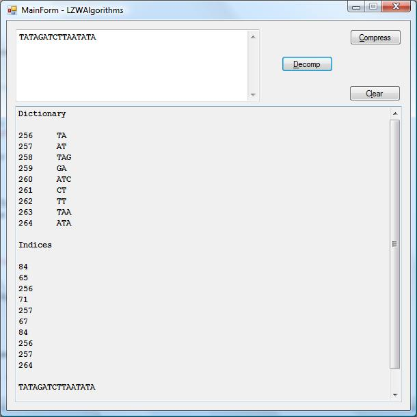

# LZW Compressor and Decompressor
## Requires
- Visual Studio 2008
## License
- MIT
## Technologies
- C#
- Visual Studio 2008
- Windows Forms
- Visual C#
## Topics
- C#
- Compression
- Algorithms
- LZW Algorithm
## Updated
- 10/13/2015
## Description

<h1>Introduction</h1>

<em>In the modern digital world of limited and expensive bandwidth compression and decompression of data are everyday necessities of life especially in the ubiquitous cloud. Like Huffman coding LZW coding is another loss less compression and decompression
 technique. 
</em>

<h1>Building the Sample</h1>

<em>This project should build as is using Visual Studio 2008. 
</em>

Description

<em>The LZW compression algorithm takes advantage of recurring patterns in the input text. In this implementation two handy data structures are utilized a Dictionary&lt;int, string&gt; entity and a List&lt;int&gt; entity. Both of these items are needed to
 regenerate the original text via the decompressor. The LZW algorithms are described in exhaustive detail in the excellent primer
<strong>Algorithms Unlocked</strong> by Thomas H. Cormen of <strong>Introduction to Algorithms</strong> fame. The example in the little book is from molecular genetics and is a fraction of a DNA sequence where A = adenine, t = thymine, C = cytosine, and G =
 guanine. A, T, C, and G are base pairs. 
</em>

<em></em>

&nbsp;

C#

Edit|Remove

csharp
<pre class="hidden">using System;
using System.Collections.Generic;
using System.Linq;
using System.Text;

namespace LZWAlgorithms
{
    class LZWCompressor
    {
        public Dictionary&lt;int, string&gt; Compressor(string text, ref List&lt;int&gt; indices)
        {
            Dictionary&lt;int, string&gt; dictionary = new Dictionary&lt;int, string&gt;();

            for (int i = 0; i &lt; 256; i&#43;&#43;)
                dictionary.Add(i, new string((char)i, 1));

            char c = '\0';
            int index = 1, n = text.Length, nextKey = 256;
            string s = new string(text[0], 1), sc = string.Empty;

            while (index &lt; n)
            {
                c = text[index&#43;&#43;];
                sc = s &#43; c;

                if (dictionary.ContainsValue(sc))
                    s = sc;

                else
                {
                    foreach (KeyValuePair&lt;int, string&gt; kvp in dictionary)
                    {
                        if (kvp.Value == s)
                        {
                            indices.Add(kvp.Key);
                            break;
                        }
                    }

                    dictionary.Add(nextKey&#43;&#43;, sc);
                    s = new string(c, 1);
                }
            }

            foreach (KeyValuePair&lt;int, string&gt; kvp in dictionary)
            {
                if (kvp.Value == s)
                {
                    indices.Add(kvp.Key);
                    break;
                }
            }

            return dictionary;
        }
    }
}</pre>

<pre class="csharp">using&nbsp;System;&nbsp;
using&nbsp;System.Collections.Generic;&nbsp;
using&nbsp;System.Linq;&nbsp;
using&nbsp;System.Text;&nbsp;
&nbsp;
namespace&nbsp;LZWAlgorithms&nbsp;
{&nbsp;
&nbsp;&nbsp;&nbsp;&nbsp;class&nbsp;LZWCompressor&nbsp;
&nbsp;&nbsp;&nbsp;&nbsp;{&nbsp;
&nbsp;&nbsp;&nbsp;&nbsp;&nbsp;&nbsp;&nbsp;&nbsp;public&nbsp;Dictionary&lt;int,&nbsp;string&gt;&nbsp;Compressor(string&nbsp;text,&nbsp;ref&nbsp;List&lt;int&gt;&nbsp;indices)&nbsp;
&nbsp;&nbsp;&nbsp;&nbsp;&nbsp;&nbsp;&nbsp;&nbsp;{&nbsp;
&nbsp;&nbsp;&nbsp;&nbsp;&nbsp;&nbsp;&nbsp;&nbsp;&nbsp;&nbsp;&nbsp;&nbsp;Dictionary&lt;int,&nbsp;string&gt;&nbsp;dictionary&nbsp;=&nbsp;new&nbsp;Dictionary&lt;int,&nbsp;string&gt;();&nbsp;
&nbsp;
&nbsp;&nbsp;&nbsp;&nbsp;&nbsp;&nbsp;&nbsp;&nbsp;&nbsp;&nbsp;&nbsp;&nbsp;for&nbsp;(int&nbsp;i&nbsp;=&nbsp;0;&nbsp;i&nbsp;&lt;&nbsp;256;&nbsp;i&#43;&#43;)&nbsp;
&nbsp;&nbsp;&nbsp;&nbsp;&nbsp;&nbsp;&nbsp;&nbsp;&nbsp;&nbsp;&nbsp;&nbsp;&nbsp;&nbsp;&nbsp;&nbsp;dictionary.Add(i,&nbsp;new&nbsp;string((char)i,&nbsp;1));&nbsp;
&nbsp;
&nbsp;&nbsp;&nbsp;&nbsp;&nbsp;&nbsp;&nbsp;&nbsp;&nbsp;&nbsp;&nbsp;&nbsp;char&nbsp;c&nbsp;=&nbsp;'\0';&nbsp;
&nbsp;&nbsp;&nbsp;&nbsp;&nbsp;&nbsp;&nbsp;&nbsp;&nbsp;&nbsp;&nbsp;&nbsp;int&nbsp;index&nbsp;=&nbsp;1,&nbsp;n&nbsp;=&nbsp;text.Length,&nbsp;nextKey&nbsp;=&nbsp;256;&nbsp;
&nbsp;&nbsp;&nbsp;&nbsp;&nbsp;&nbsp;&nbsp;&nbsp;&nbsp;&nbsp;&nbsp;&nbsp;string&nbsp;s&nbsp;=&nbsp;new&nbsp;string(text[0],&nbsp;1),&nbsp;sc&nbsp;=&nbsp;string.Empty;&nbsp;
&nbsp;
&nbsp;&nbsp;&nbsp;&nbsp;&nbsp;&nbsp;&nbsp;&nbsp;&nbsp;&nbsp;&nbsp;&nbsp;while&nbsp;(index&nbsp;&lt;&nbsp;n)&nbsp;
&nbsp;&nbsp;&nbsp;&nbsp;&nbsp;&nbsp;&nbsp;&nbsp;&nbsp;&nbsp;&nbsp;&nbsp;{&nbsp;
&nbsp;&nbsp;&nbsp;&nbsp;&nbsp;&nbsp;&nbsp;&nbsp;&nbsp;&nbsp;&nbsp;&nbsp;&nbsp;&nbsp;&nbsp;&nbsp;c&nbsp;=&nbsp;text[index&#43;&#43;];&nbsp;
&nbsp;&nbsp;&nbsp;&nbsp;&nbsp;&nbsp;&nbsp;&nbsp;&nbsp;&nbsp;&nbsp;&nbsp;&nbsp;&nbsp;&nbsp;&nbsp;sc&nbsp;=&nbsp;s&nbsp;&#43;&nbsp;c;&nbsp;
&nbsp;
&nbsp;&nbsp;&nbsp;&nbsp;&nbsp;&nbsp;&nbsp;&nbsp;&nbsp;&nbsp;&nbsp;&nbsp;&nbsp;&nbsp;&nbsp;&nbsp;if&nbsp;(dictionary.ContainsValue(sc))&nbsp;
&nbsp;&nbsp;&nbsp;&nbsp;&nbsp;&nbsp;&nbsp;&nbsp;&nbsp;&nbsp;&nbsp;&nbsp;&nbsp;&nbsp;&nbsp;&nbsp;&nbsp;&nbsp;&nbsp;&nbsp;s&nbsp;=&nbsp;sc;&nbsp;
&nbsp;
&nbsp;&nbsp;&nbsp;&nbsp;&nbsp;&nbsp;&nbsp;&nbsp;&nbsp;&nbsp;&nbsp;&nbsp;&nbsp;&nbsp;&nbsp;&nbsp;else&nbsp;
&nbsp;&nbsp;&nbsp;&nbsp;&nbsp;&nbsp;&nbsp;&nbsp;&nbsp;&nbsp;&nbsp;&nbsp;&nbsp;&nbsp;&nbsp;&nbsp;{&nbsp;
&nbsp;&nbsp;&nbsp;&nbsp;&nbsp;&nbsp;&nbsp;&nbsp;&nbsp;&nbsp;&nbsp;&nbsp;&nbsp;&nbsp;&nbsp;&nbsp;&nbsp;&nbsp;&nbsp;&nbsp;foreach&nbsp;(KeyValuePair&lt;int,&nbsp;string&gt;&nbsp;kvp&nbsp;in&nbsp;dictionary)&nbsp;
&nbsp;&nbsp;&nbsp;&nbsp;&nbsp;&nbsp;&nbsp;&nbsp;&nbsp;&nbsp;&nbsp;&nbsp;&nbsp;&nbsp;&nbsp;&nbsp;&nbsp;&nbsp;&nbsp;&nbsp;{&nbsp;
&nbsp;&nbsp;&nbsp;&nbsp;&nbsp;&nbsp;&nbsp;&nbsp;&nbsp;&nbsp;&nbsp;&nbsp;&nbsp;&nbsp;&nbsp;&nbsp;&nbsp;&nbsp;&nbsp;&nbsp;&nbsp;&nbsp;&nbsp;&nbsp;if&nbsp;(kvp.Value&nbsp;==&nbsp;s)&nbsp;
&nbsp;&nbsp;&nbsp;&nbsp;&nbsp;&nbsp;&nbsp;&nbsp;&nbsp;&nbsp;&nbsp;&nbsp;&nbsp;&nbsp;&nbsp;&nbsp;&nbsp;&nbsp;&nbsp;&nbsp;&nbsp;&nbsp;&nbsp;&nbsp;{&nbsp;
&nbsp;&nbsp;&nbsp;&nbsp;&nbsp;&nbsp;&nbsp;&nbsp;&nbsp;&nbsp;&nbsp;&nbsp;&nbsp;&nbsp;&nbsp;&nbsp;&nbsp;&nbsp;&nbsp;&nbsp;&nbsp;&nbsp;&nbsp;&nbsp;&nbsp;&nbsp;&nbsp;&nbsp;indices.Add(kvp.Key);&nbsp;
&nbsp;&nbsp;&nbsp;&nbsp;&nbsp;&nbsp;&nbsp;&nbsp;&nbsp;&nbsp;&nbsp;&nbsp;&nbsp;&nbsp;&nbsp;&nbsp;&nbsp;&nbsp;&nbsp;&nbsp;&nbsp;&nbsp;&nbsp;&nbsp;&nbsp;&nbsp;&nbsp;&nbsp;break;&nbsp;
&nbsp;&nbsp;&nbsp;&nbsp;&nbsp;&nbsp;&nbsp;&nbsp;&nbsp;&nbsp;&nbsp;&nbsp;&nbsp;&nbsp;&nbsp;&nbsp;&nbsp;&nbsp;&nbsp;&nbsp;&nbsp;&nbsp;&nbsp;&nbsp;}&nbsp;
&nbsp;&nbsp;&nbsp;&nbsp;&nbsp;&nbsp;&nbsp;&nbsp;&nbsp;&nbsp;&nbsp;&nbsp;&nbsp;&nbsp;&nbsp;&nbsp;&nbsp;&nbsp;&nbsp;&nbsp;}&nbsp;
&nbsp;
&nbsp;&nbsp;&nbsp;&nbsp;&nbsp;&nbsp;&nbsp;&nbsp;&nbsp;&nbsp;&nbsp;&nbsp;&nbsp;&nbsp;&nbsp;&nbsp;&nbsp;&nbsp;&nbsp;&nbsp;dictionary.Add(nextKey&#43;&#43;,&nbsp;sc);&nbsp;
&nbsp;&nbsp;&nbsp;&nbsp;&nbsp;&nbsp;&nbsp;&nbsp;&nbsp;&nbsp;&nbsp;&nbsp;&nbsp;&nbsp;&nbsp;&nbsp;&nbsp;&nbsp;&nbsp;&nbsp;s&nbsp;=&nbsp;new&nbsp;string(c,&nbsp;1);&nbsp;
&nbsp;&nbsp;&nbsp;&nbsp;&nbsp;&nbsp;&nbsp;&nbsp;&nbsp;&nbsp;&nbsp;&nbsp;&nbsp;&nbsp;&nbsp;&nbsp;}&nbsp;
&nbsp;&nbsp;&nbsp;&nbsp;&nbsp;&nbsp;&nbsp;&nbsp;&nbsp;&nbsp;&nbsp;&nbsp;}&nbsp;
&nbsp;
&nbsp;&nbsp;&nbsp;&nbsp;&nbsp;&nbsp;&nbsp;&nbsp;&nbsp;&nbsp;&nbsp;&nbsp;foreach&nbsp;(KeyValuePair&lt;int,&nbsp;string&gt;&nbsp;kvp&nbsp;in&nbsp;dictionary)&nbsp;
&nbsp;&nbsp;&nbsp;&nbsp;&nbsp;&nbsp;&nbsp;&nbsp;&nbsp;&nbsp;&nbsp;&nbsp;{&nbsp;
&nbsp;&nbsp;&nbsp;&nbsp;&nbsp;&nbsp;&nbsp;&nbsp;&nbsp;&nbsp;&nbsp;&nbsp;&nbsp;&nbsp;&nbsp;&nbsp;if&nbsp;(kvp.Value&nbsp;==&nbsp;s)&nbsp;
&nbsp;&nbsp;&nbsp;&nbsp;&nbsp;&nbsp;&nbsp;&nbsp;&nbsp;&nbsp;&nbsp;&nbsp;&nbsp;&nbsp;&nbsp;&nbsp;{&nbsp;
&nbsp;&nbsp;&nbsp;&nbsp;&nbsp;&nbsp;&nbsp;&nbsp;&nbsp;&nbsp;&nbsp;&nbsp;&nbsp;&nbsp;&nbsp;&nbsp;&nbsp;&nbsp;&nbsp;&nbsp;indices.Add(kvp.Key);&nbsp;
&nbsp;&nbsp;&nbsp;&nbsp;&nbsp;&nbsp;&nbsp;&nbsp;&nbsp;&nbsp;&nbsp;&nbsp;&nbsp;&nbsp;&nbsp;&nbsp;&nbsp;&nbsp;&nbsp;&nbsp;break;&nbsp;
&nbsp;&nbsp;&nbsp;&nbsp;&nbsp;&nbsp;&nbsp;&nbsp;&nbsp;&nbsp;&nbsp;&nbsp;&nbsp;&nbsp;&nbsp;&nbsp;}&nbsp;
&nbsp;&nbsp;&nbsp;&nbsp;&nbsp;&nbsp;&nbsp;&nbsp;&nbsp;&nbsp;&nbsp;&nbsp;}&nbsp;
&nbsp;
&nbsp;&nbsp;&nbsp;&nbsp;&nbsp;&nbsp;&nbsp;&nbsp;&nbsp;&nbsp;&nbsp;&nbsp;return&nbsp;dictionary;&nbsp;
&nbsp;&nbsp;&nbsp;&nbsp;&nbsp;&nbsp;&nbsp;&nbsp;}&nbsp;
&nbsp;&nbsp;&nbsp;&nbsp;}&nbsp;
}</pre>

&nbsp;

<h1>Source Code Files</h1>
<ul>
<li><em>LZWCompressor.cs - the compression algorithm.</em> </li><li><em><em>LZWDecompressor.cs - the decompression algorithm.</em></em> </li><li><em>MainForm.cs - the main and only form of the application for input and output.</em>
</li><li><em>Program.cs - the Visual Studio 2008 generated program class.</em> </li></ul>
<h1>More Information</h1>

<em>For more information on loss less compression, see the excellent little read mentioned in the
<strong>Discussion</strong> section or scour the Internet more specifically the web for scholarly papers. 
</em>

