# Launch your own website in 15 minutes using IIS (Through LocalHost)
## License
- MIT
## Technologies
- IIS
- Web
## Topics
- Web Services
## Updated
- 04/27/2015
## Description

Description :

<h1>Introduction</h1>

Of course many humans are passionate to launch their own website as needed. To meet this, Microsoft IIS provide one of a way to launch a website, Here it&rsquo;s a tour on basic IIS operation that helps to launch their own website in their Local Host, May
 be many resource available on internet to study about IIS, But I hope this article for very beginner level also who try to test their Web application in their local machine so it may one of the quiet interesting among them and will enjoy a great play with
 Microsoft IIS.

<h1>IIS</h1>

IIS &ndash; Internet Information Services, is an extensible web server created by Microsoft for use with Windows NT family. IIS supports HTTP, HTTPS, FTP, FTPS, SMTP and NNTP. It has been an integral part of the Windows NT family since Windows NT 4.0, though
 it may be absent from some editions. IIS is not turned on by default when Windows is installed. The IIS Manager is accessed through the Microsoft Management Console or Administrative Tools in the Control Panel.

<h1>Basic Preparations / Configurations</h1>

Before asscesing IIS on your machine please ensure the machine&rsquo;s Firewall is turn off. To avoid restriction on launching you site. To turn off the Firewall please follow the steps.

<ol>
<li>Open &ldquo;Customize Window&rdquo; Windows from <strong>Control Panel\All Control Panel Items\Windows Firewall\Customize Settings.</strong>
</li><li><strong>&nbsp;</strong>Click <strong>Turn off Windows Firewall.</strong><strong>&nbsp;</strong>
</li></ol>

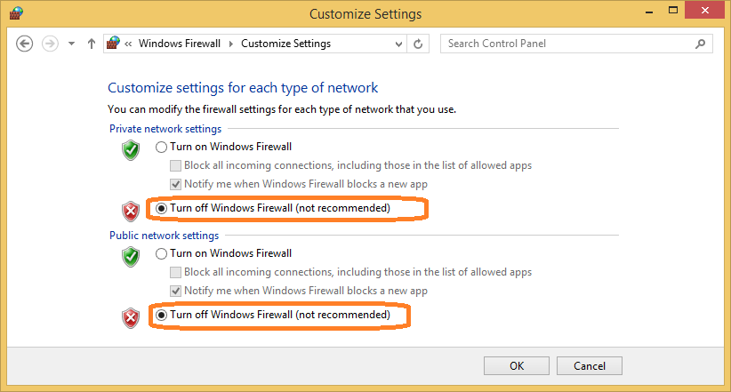

&nbsp;

<h1>How to Reach IIS in Windows 8.1 Machine</h1>

To open IIS Manager, Just search on you Windows Machine using the Keyword &ldquo;IIS&rdquo;. It filters
<strong>Internet Information Services (IIS) Manager </strong>and perform a mouse click on it to open the IIS.

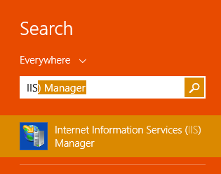

&nbsp;

<h2><strong>IIS Window</strong></h2>

<strong>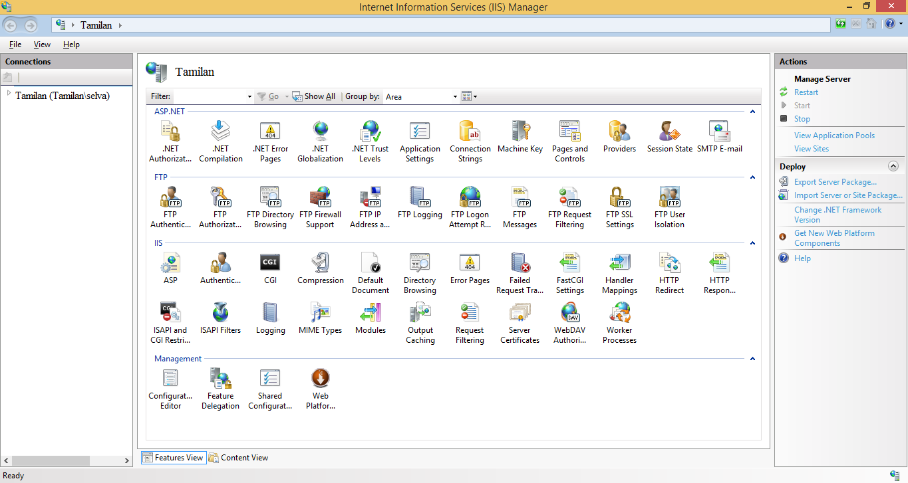 
</strong>

&nbsp;

<h1>Launch a Web Site</h1>

By default IIS provide default in the name of &ldquo;Default Web Site&rdquo; to launch your site. You can use this or else create a new one.&nbsp;

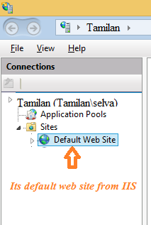

<h4>To create a new website right click on &ldquo;Sites&rdquo; and click on &ldquo;Add Website&hellip;&rdquo; menu to open a dialog.</h4>

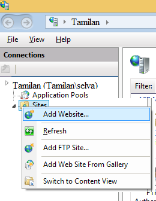

<h4>Fill the necessary details in the dialog as required Like <strong>SiteName </strong>
(It will not affect your domain name, Its just name of your site&rsquo;s name and will not reflect in your web address),
<strong>Physical path</strong>, <strong>Port</strong> (80 as default) and <strong>
Host name </strong>(Not Mandatory) , Also check <strong>Start website immediately
</strong>&nbsp;to ready to publish.&nbsp;</h4>

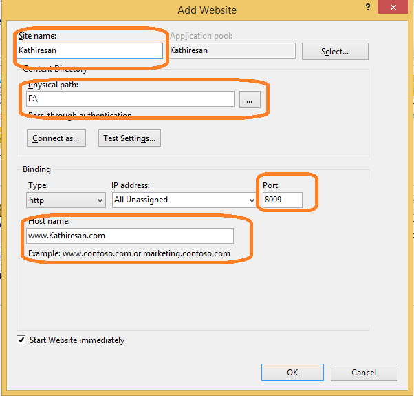

&nbsp;

<h4>Now your new website is added under your IIS <strong>Sites</strong>.&nbsp;</h4>

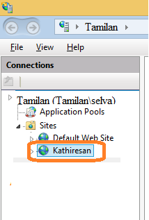

<h4>Create a simple web application to launch (for ex. In HTML) using the following code in
<strong>notepad </strong>&nbsp;and save it as &ldquo;test.html&rdquo; &nbsp;in any location on the physical path for example
<strong>F:\MyWebsiteProgram. </strong>Now web application is ready</h4>
<h4>Then open your browser and type your web address with port and path of the web application for example here it is http://www.kathiresan.com:8099/test.html</h4>

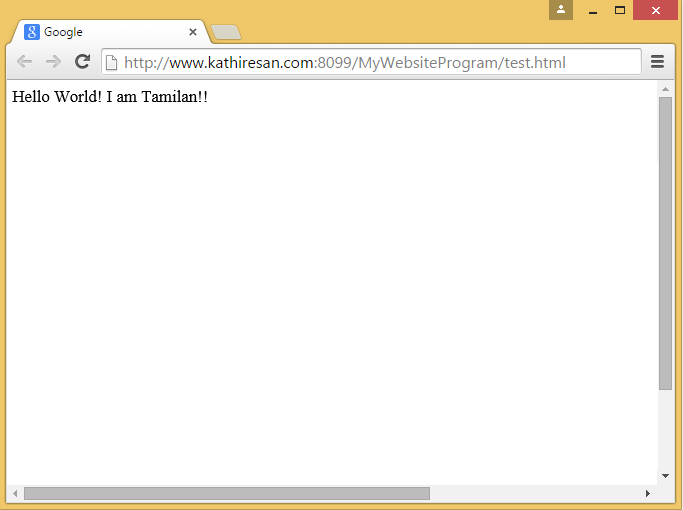

<h4>Also you can use it and follow same procedure in <strong>Default Web Site</strong> or else you can&nbsp; use
<strong>inetpub </strong>&nbsp;to launch you web application. i.e., you can simple move you application folder in &ldquo;<strong>C:\inetpub\wwwroot</strong>&rdquo; it will added under your
<strong>Default Web Site</strong> as below, if this will not present then just right click on
<strong>Default Web Site </strong>and click <strong>Refresh </strong>&nbsp;menu.</h4>

&nbsp;

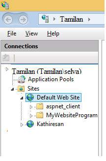

<h4><strong>&nbsp;</strong>Now convert it to application by right click on the folder and click
<strong>Convert To Application </strong>Menu&nbsp;</h4>

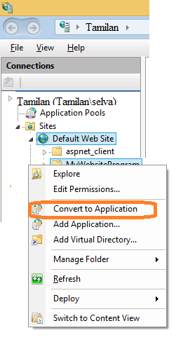

&nbsp;

<h4>It will open a dialog and click ok on it.</h4>

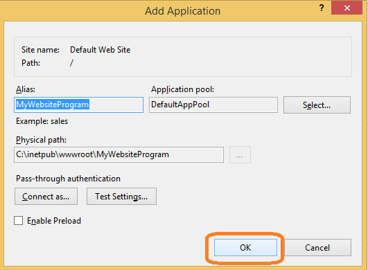

<h4><strong>&nbsp;</strong>Now open the browser with the address <strong><a href="http://localhost/MyWebsiteProgram/test.html">http://localhost/MyWebsiteProgram/test.html</a></strong> . Now it&rsquo;s done&nbsp;</h4>
