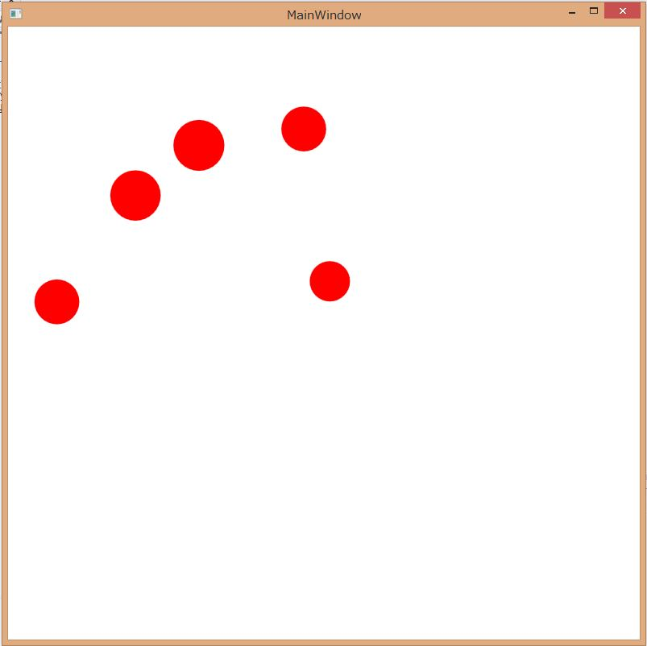

# LeapMotionで指の先を画面に表示する
## Requires
- Visual Studio 2013
## License
- Apache License, Version 2.0
## Technologies
- Leap Motion
## Topics
- Leap Motion
## Updated
- 06/29/2014
## Description

<h1>サンプルプログラムの概要</h1>

このサンプルプログラムは、LeapMotionのv2(beta)を使って、画面上に認識した手の指先の場所を表示するサンプルプログラムです。

指の位置は、丸で表示されます。Leap Motionで検出したX座標Y座標を、ウィンドウ内の位置に変換して表示しています。丸の大きさはZ軸の座標をベースに50px～150pxの大きさで変化します。

<h1>サンプルプログラムの実行方法</h1>

サンプルプログラムには、Leap MotionのSDKのDLLは同梱していません。ダウンロードしたサンプルプログラムを解凍したあとにLeap MotionのサイトからSDKをダウンロードしてプロジェクトファイル直下にDLLを置いてください。

<ul>
<li>Leap Motionのサイト 
https://developer.leapmotion.com/ </li><li>プロジェクト直下に置く必要のあるDLL
<ul>
<li>&nbsp;Leap.dll </li><li>LeapCSharp.dll(x86) </li><li>LeapCSharp.NET4.0.dll(x86) </li></ul>
</li></ul>

DLLを置いてビルドをするとNuGetのパッケージの復元が行われてサンプルプログラムが実行されます。

<h1>サンプルプログラムのポイント</h1>

このサンプルプログラムのポイントを説明します。

<h2>Leap Motionからの値の処理</h2>

このサンプルプログラムでは、Leap Motionから受け取った値の処理をReactivePropertyとReactive Extensionを使って処理をしています。Leap MotionのListenerから、Frameを取り出し、Modelクラスに用意したFrameを受け取るReactivePropertyにセットしています。

C#

スクリプトの編集|Remove

csharp
<pre class="hidden">class LeapListener : Listener
{
    private Model model;

    public LeapListener(Model model)
    {
        this.model = model;
    }

    public override void OnFrame(Controller c)
    {
        this.model.Frame.Value = c.Frame();
    }
}
</pre>

<pre class="csharp">class&nbsp;LeapListener&nbsp;:&nbsp;Listener&nbsp;
{&nbsp;
&nbsp;&nbsp;&nbsp;&nbsp;private&nbsp;Model&nbsp;model;&nbsp;
&nbsp;
&nbsp;&nbsp;&nbsp;&nbsp;public&nbsp;LeapListener(Model&nbsp;model)&nbsp;
&nbsp;&nbsp;&nbsp;&nbsp;{&nbsp;
&nbsp;&nbsp;&nbsp;&nbsp;&nbsp;&nbsp;&nbsp;&nbsp;this.model&nbsp;=&nbsp;model;&nbsp;
&nbsp;&nbsp;&nbsp;&nbsp;}&nbsp;
&nbsp;
&nbsp;&nbsp;&nbsp;&nbsp;public&nbsp;override&nbsp;void&nbsp;OnFrame(Controller&nbsp;c)&nbsp;
&nbsp;&nbsp;&nbsp;&nbsp;{&nbsp;
&nbsp;&nbsp;&nbsp;&nbsp;&nbsp;&nbsp;&nbsp;&nbsp;this.model.Frame.Value&nbsp;=&nbsp;c.Frame();&nbsp;
&nbsp;&nbsp;&nbsp;&nbsp;}&nbsp;
}&nbsp;
</pre>

&nbsp;

Model内では、Frameから左手と右手を抽出しています。Modelクラスのコンストラクタに該当するコードがあります。

C#

スクリプトの編集|Remove

csharp
<pre class="hidden">this.Frame = new ReactiveProperty&lt;Leap.Frame&gt;();
var frames = this.Frame
    .Where(f =&gt; f != null)
    .Sample(TimeSpan.FromSeconds(1 / 60.0));

var leftHand = frames
    .Select(f =&gt; f.Hands)
    .Select(hs =&gt; hs.FirstOrDefault(h =&gt; h.IsLeft));

var rightHand = frames
    .Select(f =&gt; f.Hands)
    .Select(hs =&gt; hs.FirstOrDefault(h =&gt; h.IsRight));
</pre>

<pre class="csharp">this.Frame&nbsp;=&nbsp;new&nbsp;ReactiveProperty&lt;Leap.Frame&gt;();&nbsp;
var&nbsp;frames&nbsp;=&nbsp;this.Frame&nbsp;
&nbsp;&nbsp;&nbsp;&nbsp;.Where(f&nbsp;=&gt;&nbsp;f&nbsp;!=&nbsp;null)&nbsp;
&nbsp;&nbsp;&nbsp;&nbsp;.Sample(TimeSpan.FromSeconds(1&nbsp;/&nbsp;60.0));&nbsp;
&nbsp;
var&nbsp;leftHand&nbsp;=&nbsp;frames&nbsp;
&nbsp;&nbsp;&nbsp;&nbsp;.Select(f&nbsp;=&gt;&nbsp;f.Hands)&nbsp;
&nbsp;&nbsp;&nbsp;&nbsp;.Select(hs&nbsp;=&gt;&nbsp;hs.FirstOrDefault(h&nbsp;=&gt;&nbsp;h.IsLeft));&nbsp;
&nbsp;
var&nbsp;rightHand&nbsp;=&nbsp;frames&nbsp;
&nbsp;&nbsp;&nbsp;&nbsp;.Select(f&nbsp;=&gt;&nbsp;f.Hands)&nbsp;
&nbsp;&nbsp;&nbsp;&nbsp;.Select(hs&nbsp;=&gt;&nbsp;hs.FirstOrDefault(h&nbsp;=&gt;&nbsp;h.IsRight));&nbsp;
</pre>

&nbsp;

上記コードでは、Frameを60分の1秒間隔で取得して、その中から左手、右手を取得しています。続きのコードで、手が取得できた場合は指の情報を取得して指の場所をLeap MotionのInteractionBoxを使って-1～1の間に正規化しています。

C#

スクリプトの編集|Remove

csharp
<pre class="hidden">this.LeftHandFingers = leftHand
    .Where(h =&gt; h != null)
    .Select(h =&gt; h.Fingers)
    .Select(fs =&gt;
    {
        var frame = fs.Leftmost.Frame;
        return fs
            .Select(f =&gt; frame.InteractionBox.NormalizePoint(f.TipPosition))
            .Select(v =&gt; new FingerPoint { X = v.x, Y = v.y, Z = v.z })
            .ToList();
    })
    .ToReactiveProperty();
</pre>

<pre class="csharp">this.LeftHandFingers&nbsp;=&nbsp;leftHand&nbsp;
&nbsp;&nbsp;&nbsp;&nbsp;.Where(h&nbsp;=&gt;&nbsp;h&nbsp;!=&nbsp;null)&nbsp;
&nbsp;&nbsp;&nbsp;&nbsp;.Select(h&nbsp;=&gt;&nbsp;h.Fingers)&nbsp;
&nbsp;&nbsp;&nbsp;&nbsp;.Select(fs&nbsp;=&gt;&nbsp;
&nbsp;&nbsp;&nbsp;&nbsp;{&nbsp;
&nbsp;&nbsp;&nbsp;&nbsp;&nbsp;&nbsp;&nbsp;&nbsp;var&nbsp;frame&nbsp;=&nbsp;fs.Leftmost.Frame;&nbsp;
&nbsp;&nbsp;&nbsp;&nbsp;&nbsp;&nbsp;&nbsp;&nbsp;return&nbsp;fs&nbsp;
&nbsp;&nbsp;&nbsp;&nbsp;&nbsp;&nbsp;&nbsp;&nbsp;&nbsp;&nbsp;&nbsp;&nbsp;.Select(f&nbsp;=&gt;&nbsp;frame.InteractionBox.NormalizePoint(f.TipPosition))&nbsp;
&nbsp;&nbsp;&nbsp;&nbsp;&nbsp;&nbsp;&nbsp;&nbsp;&nbsp;&nbsp;&nbsp;&nbsp;.Select(v&nbsp;=&gt;&nbsp;new&nbsp;FingerPoint&nbsp;{&nbsp;X&nbsp;=&nbsp;v.x,&nbsp;Y&nbsp;=&nbsp;v.y,&nbsp;Z&nbsp;=&nbsp;v.z&nbsp;})&nbsp;
&nbsp;&nbsp;&nbsp;&nbsp;&nbsp;&nbsp;&nbsp;&nbsp;&nbsp;&nbsp;&nbsp;&nbsp;.ToList();&nbsp;
&nbsp;&nbsp;&nbsp;&nbsp;})&nbsp;
&nbsp;&nbsp;&nbsp;&nbsp;.ToReactiveProperty();&nbsp;
</pre>

そして、最後に、ReactivePropertyに変換をしてプロパティに設定しています。

<h2 class="endscriptcode">画面に表示する座標への変換</h2>

-1～1の値に正規化された値を画面の座標に変換するのは、Converterで実装しています。ApplicationクラスからMainWindowを取得して幅と高さを算出しています。

C#

スクリプトの編集|Remove

csharp
<pre class="hidden">public class MarginConverter : IValueConverter
{
    public object Convert(object value, Type targetType, object parameter, System.Globalization.CultureInfo culture)
    {
        var width = Application.Current.MainWindow.ActualWidth;
        var height = Application.Current.MainWindow.ActualHeight;
        var pos = (FingerPoint)value;
        var result = new Thickness();

        result.Top = height - height * pos.Y;
        result.Left = width * pos.X;

        return result;
    }

    public object ConvertBack(object value, Type targetType, object parameter, System.Globalization.CultureInfo culture)
    {
        throw new NotImplementedException();
    }
}</pre>

<pre class="csharp">public&nbsp;class&nbsp;MarginConverter&nbsp;:&nbsp;IValueConverter&nbsp;
{&nbsp;
&nbsp;&nbsp;&nbsp;&nbsp;public&nbsp;object&nbsp;Convert(object&nbsp;value,&nbsp;Type&nbsp;targetType,&nbsp;object&nbsp;parameter,&nbsp;System.Globalization.CultureInfo&nbsp;culture)&nbsp;
&nbsp;&nbsp;&nbsp;&nbsp;{&nbsp;
&nbsp;&nbsp;&nbsp;&nbsp;&nbsp;&nbsp;&nbsp;&nbsp;var&nbsp;width&nbsp;=&nbsp;Application.Current.MainWindow.ActualWidth;&nbsp;
&nbsp;&nbsp;&nbsp;&nbsp;&nbsp;&nbsp;&nbsp;&nbsp;var&nbsp;height&nbsp;=&nbsp;Application.Current.MainWindow.ActualHeight;&nbsp;
&nbsp;&nbsp;&nbsp;&nbsp;&nbsp;&nbsp;&nbsp;&nbsp;var&nbsp;pos&nbsp;=&nbsp;(FingerPoint)value;&nbsp;
&nbsp;&nbsp;&nbsp;&nbsp;&nbsp;&nbsp;&nbsp;&nbsp;var&nbsp;result&nbsp;=&nbsp;new&nbsp;Thickness();&nbsp;
&nbsp;
&nbsp;&nbsp;&nbsp;&nbsp;&nbsp;&nbsp;&nbsp;&nbsp;result.Top&nbsp;=&nbsp;height&nbsp;-&nbsp;height&nbsp;*&nbsp;pos.Y;&nbsp;
&nbsp;&nbsp;&nbsp;&nbsp;&nbsp;&nbsp;&nbsp;&nbsp;result.Left&nbsp;=&nbsp;width&nbsp;*&nbsp;pos.X;&nbsp;
&nbsp;
&nbsp;&nbsp;&nbsp;&nbsp;&nbsp;&nbsp;&nbsp;&nbsp;return&nbsp;result;&nbsp;
&nbsp;&nbsp;&nbsp;&nbsp;}&nbsp;
&nbsp;
&nbsp;&nbsp;&nbsp;&nbsp;public&nbsp;object&nbsp;ConvertBack(object&nbsp;value,&nbsp;Type&nbsp;targetType,&nbsp;object&nbsp;parameter,&nbsp;System.Globalization.CultureInfo&nbsp;culture)&nbsp;
&nbsp;&nbsp;&nbsp;&nbsp;{&nbsp;
&nbsp;&nbsp;&nbsp;&nbsp;&nbsp;&nbsp;&nbsp;&nbsp;throw&nbsp;new&nbsp;NotImplementedException();&nbsp;
&nbsp;&nbsp;&nbsp;&nbsp;}&nbsp;
}</pre>

&nbsp;

<h2 class="endscriptcode">丸の大きさへの変換</h2>

Z座標から丸の大きさへの変換もConverterを使って行っています。SizeConverterでZ座標から算出を行っています。

C#

スクリプトの編集|Remove

csharp
<pre class="hidden">public double BaseSize { get; set; }

public object Convert(object value, Type targetType, object parameter, System.Globalization.CultureInfo culture)
{
    var pos = (FingerPoint)value;
    var z = -1 * (pos.Z - 1);
    return this.BaseSize &#43; this.BaseSize * z;
}</pre>

<pre class="js">public&nbsp;double&nbsp;BaseSize&nbsp;{&nbsp;get;&nbsp;set;&nbsp;}&nbsp;
&nbsp;
public&nbsp;object&nbsp;Convert(object&nbsp;value,&nbsp;Type&nbsp;targetType,&nbsp;object&nbsp;parameter,&nbsp;System.Globalization.CultureInfo&nbsp;culture)&nbsp;
{&nbsp;
&nbsp;&nbsp;&nbsp;&nbsp;var&nbsp;pos&nbsp;=&nbsp;(FingerPoint)value;&nbsp;
&nbsp;&nbsp;&nbsp;&nbsp;var&nbsp;z&nbsp;=&nbsp;-1&nbsp;*&nbsp;(pos.Z&nbsp;-&nbsp;1);&nbsp;
&nbsp;&nbsp;&nbsp;&nbsp;return&nbsp;this.BaseSize&nbsp;&#43;&nbsp;this.BaseSize&nbsp;*&nbsp;z;&nbsp;
}</pre>

&nbsp;

