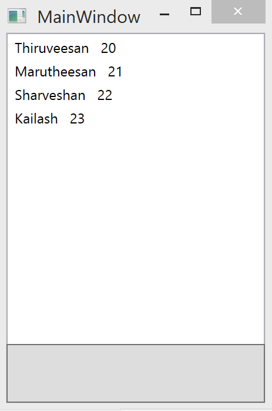

# Learn Simple MVVM and Command Bindings
## Requires
- Visual Studio 2012
## License
- MIT
## Technologies
- WPF
- ViewModel pattern (MVVM)
- MVVM
- Visual C#
## Topics
- WPF
- ViewModel pattern (MVVM)
- MVVM
- Visual C#
## Updated
- 04/20/2015
## Description

<h1>Description :</h1>

As we know that the most powerful WPF&rsquo;s framework (SL as well) can be built with the most optimal architectural pattern the MVVM. The MVVM is collaborative of Model, View and View Model. And the MVVM is special introduce to simplify the event driven
 programming of user interface. The MVVM and Presentation Model both derived from Model View Controller.

&nbsp;

<strong>MVVM pattern component</strong>

<strong>Model</strong>: It&rsquo;s a domain model that represent the real time entity or an object as a data access layer

<strong>View</strong>: It&rsquo;s a User interface probably a front end design

<strong>&nbsp;View Model</strong>: It&rsquo;s a simply a data representation of Model through with public properties and commands

<strong>Binder</strong>: It&rsquo;s a data and command binding between View and View Model for Model

through binder, view model, and any business layers features to validate incoming data. The result is that the model and framework drive as much of the operations as possible, customize application logic which directly &nbsp;controling the view

<strong>Structure of MVVM</strong>

&nbsp;

&nbsp;

&nbsp;

&nbsp;

<strong>Model</strong>

Here i have used a person as model that contains name and age of the person

C#

Edit|Remove

csharp
<pre class="hidden">namespace MVVM
{
    public class Person
    {
        public string Name { get; set; }

        public int Age { get; set; }
    }
}</pre>

<pre class="csharp">namespace&nbsp;MVVM&nbsp;
{&nbsp;
&nbsp;&nbsp;&nbsp;&nbsp;public&nbsp;class&nbsp;Person&nbsp;
&nbsp;&nbsp;&nbsp;&nbsp;{&nbsp;
&nbsp;&nbsp;&nbsp;&nbsp;&nbsp;&nbsp;&nbsp;&nbsp;public&nbsp;string&nbsp;Name&nbsp;{&nbsp;get;&nbsp;set;&nbsp;}&nbsp;
&nbsp;
&nbsp;&nbsp;&nbsp;&nbsp;&nbsp;&nbsp;&nbsp;&nbsp;public&nbsp;int&nbsp;Age&nbsp;{&nbsp;get;&nbsp;set;&nbsp;}&nbsp;
&nbsp;&nbsp;&nbsp;&nbsp;}&nbsp;
}</pre>

<strong><em>View</em></strong>

It is a User inderface design. Here i used to list out the persons in List view

&nbsp;

XAML

Edit|Remove

xaml
<pre class="hidden">&lt;Window x:Class=&quot;MVVM.MainWindow&quot;
        xmlns=&quot;http://schemas.microsoft.com/winfx/2006/xaml/presentation&quot;
        xmlns:x=&quot;http://schemas.microsoft.com/winfx/2006/xaml&quot;
        xmlns:local=&quot;clr-namespace:MVVM&quot;
        Title=&quot;MainWindow&quot; Height=&quot;350&quot; Width=&quot;525&quot;&gt;

    &lt;Grid&gt;
        &lt;ListView x:Name=&quot;ListViewPerson&quot; ItemsSource=&quot;{Binding}&quot;&gt;
            &lt;ListView.ItemTemplate&gt;
                &lt;DataTemplate&gt;
                    &lt;StackPanel Orientation=&quot;Horizontal&quot;&gt;
                        &lt;TextBlock Text=&quot;{Binding Name}&quot;&gt;&lt;/TextBlock&gt;
                        &lt;TextBlock Margin=&quot;10,0,0,0&quot; Text=&quot;{Binding Age}&quot;&gt;&lt;/TextBlock&gt;
                    &lt;/StackPanel&gt;
                &lt;/DataTemplate&gt;
            &lt;/ListView.ItemTemplate&gt;
        &lt;/ListView&gt;
    &lt;/Grid&gt;
&lt;/Window&gt;
</pre>

<pre class="xaml">&lt;Window&nbsp;x:Class=&quot;MVVM.MainWindow&quot;&nbsp;
&nbsp;&nbsp;&nbsp;&nbsp;&nbsp;&nbsp;&nbsp;&nbsp;xmlns=&quot;http://schemas.microsoft.com/winfx/2006/xaml/presentation&quot;&nbsp;
&nbsp;&nbsp;&nbsp;&nbsp;&nbsp;&nbsp;&nbsp;&nbsp;xmlns:x=&quot;http://schemas.microsoft.com/winfx/2006/xaml&quot;&nbsp;
&nbsp;&nbsp;&nbsp;&nbsp;&nbsp;&nbsp;&nbsp;&nbsp;xmlns:local=&quot;clr-namespace:MVVM&quot;&nbsp;
&nbsp;&nbsp;&nbsp;&nbsp;&nbsp;&nbsp;&nbsp;&nbsp;Title=&quot;MainWindow&quot;&nbsp;Height=&quot;350&quot;&nbsp;Width=&quot;525&quot;&gt;&nbsp;
&nbsp;
&nbsp;&nbsp;&nbsp;&nbsp;&lt;Grid&gt;&nbsp;
&nbsp;&nbsp;&nbsp;&nbsp;&nbsp;&nbsp;&nbsp;&nbsp;&lt;ListView&nbsp;x:Name=&quot;ListViewPerson&quot;&nbsp;ItemsSource=&quot;{Binding}&quot;&gt;&nbsp;
&nbsp;&nbsp;&nbsp;&nbsp;&nbsp;&nbsp;&nbsp;&nbsp;&nbsp;&nbsp;&nbsp;&nbsp;&lt;ListView.ItemTemplate&gt;&nbsp;
&nbsp;&nbsp;&nbsp;&nbsp;&nbsp;&nbsp;&nbsp;&nbsp;&nbsp;&nbsp;&nbsp;&nbsp;&nbsp;&nbsp;&nbsp;&nbsp;&lt;DataTemplate&gt;&nbsp;
&nbsp;&nbsp;&nbsp;&nbsp;&nbsp;&nbsp;&nbsp;&nbsp;&nbsp;&nbsp;&nbsp;&nbsp;&nbsp;&nbsp;&nbsp;&nbsp;&nbsp;&nbsp;&nbsp;&nbsp;&lt;StackPanel&nbsp;Orientation=&quot;Horizontal&quot;&gt;&nbsp;
&nbsp;&nbsp;&nbsp;&nbsp;&nbsp;&nbsp;&nbsp;&nbsp;&nbsp;&nbsp;&nbsp;&nbsp;&nbsp;&nbsp;&nbsp;&nbsp;&nbsp;&nbsp;&nbsp;&nbsp;&nbsp;&nbsp;&nbsp;&nbsp;&lt;TextBlock&nbsp;Text=&quot;{Binding&nbsp;Name}&quot;&gt;&lt;/TextBlock&gt;&nbsp;
&nbsp;&nbsp;&nbsp;&nbsp;&nbsp;&nbsp;&nbsp;&nbsp;&nbsp;&nbsp;&nbsp;&nbsp;&nbsp;&nbsp;&nbsp;&nbsp;&nbsp;&nbsp;&nbsp;&nbsp;&nbsp;&nbsp;&nbsp;&nbsp;&lt;TextBlock&nbsp;Margin=&quot;10,0,0,0&quot;&nbsp;Text=&quot;{Binding&nbsp;Age}&quot;&gt;&lt;/TextBlock&gt;&nbsp;
&nbsp;&nbsp;&nbsp;&nbsp;&nbsp;&nbsp;&nbsp;&nbsp;&nbsp;&nbsp;&nbsp;&nbsp;&nbsp;&nbsp;&nbsp;&nbsp;&nbsp;&nbsp;&nbsp;&nbsp;&lt;/StackPanel&gt;&nbsp;
&nbsp;&nbsp;&nbsp;&nbsp;&nbsp;&nbsp;&nbsp;&nbsp;&nbsp;&nbsp;&nbsp;&nbsp;&nbsp;&nbsp;&nbsp;&nbsp;&lt;/DataTemplate&gt;&nbsp;
&nbsp;&nbsp;&nbsp;&nbsp;&nbsp;&nbsp;&nbsp;&nbsp;&nbsp;&nbsp;&nbsp;&nbsp;&lt;/ListView.ItemTemplate&gt;&nbsp;
&nbsp;&nbsp;&nbsp;&nbsp;&nbsp;&nbsp;&nbsp;&nbsp;&lt;/ListView&gt;&nbsp;
&nbsp;&nbsp;&nbsp;&nbsp;&lt;/Grid&gt;&nbsp;
&lt;/Window&gt;&nbsp;
</pre>

&nbsp;

&nbsp;

<strong><em>View Model</em></strong>

View model consist a collection of data that binded with UI i.e., View

&nbsp;

&nbsp;

C#

Edit|Remove

csharp
<pre class="hidden">namespace MVVM
{
    public class ViewModel
    {
        public ObservableCollection&lt;Person&gt; People;

        public ViewModel()
        {
            People = new ObservableCollection&lt;Person&gt;();
            Person person = new Person() { Name=&quot;Thiruveesan&quot;, Age=20 };
            People.Add(person);
            person = new Person() { Name = &quot;Marutheesan&quot;, Age = 21 };
            People.Add(person);
            person = new Person() { Name = &quot;Sharveshan&quot;, Age = 22 };
            People.Add(person);
            person = new Person() { Name = &quot;Kailash&quot;, Age = 23 };
            People.Add(person);
             
        }
   }
}</pre>

<pre class="csharp">namespace&nbsp;MVVM&nbsp;
{&nbsp;
&nbsp;&nbsp;&nbsp;&nbsp;public&nbsp;class&nbsp;ViewModel&nbsp;
&nbsp;&nbsp;&nbsp;&nbsp;{&nbsp;
&nbsp;&nbsp;&nbsp;&nbsp;&nbsp;&nbsp;&nbsp;&nbsp;public&nbsp;ObservableCollection&lt;Person&gt;&nbsp;People;&nbsp;
&nbsp;
&nbsp;&nbsp;&nbsp;&nbsp;&nbsp;&nbsp;&nbsp;&nbsp;public&nbsp;ViewModel()&nbsp;
&nbsp;&nbsp;&nbsp;&nbsp;&nbsp;&nbsp;&nbsp;&nbsp;{&nbsp;
&nbsp;&nbsp;&nbsp;&nbsp;&nbsp;&nbsp;&nbsp;&nbsp;&nbsp;&nbsp;&nbsp;&nbsp;People&nbsp;=&nbsp;new&nbsp;ObservableCollection&lt;Person&gt;();&nbsp;
&nbsp;&nbsp;&nbsp;&nbsp;&nbsp;&nbsp;&nbsp;&nbsp;&nbsp;&nbsp;&nbsp;&nbsp;Person&nbsp;person&nbsp;=&nbsp;new&nbsp;Person()&nbsp;{&nbsp;Name=&quot;Thiruveesan&quot;,&nbsp;Age=20&nbsp;};&nbsp;
&nbsp;&nbsp;&nbsp;&nbsp;&nbsp;&nbsp;&nbsp;&nbsp;&nbsp;&nbsp;&nbsp;&nbsp;People.Add(person);&nbsp;
&nbsp;&nbsp;&nbsp;&nbsp;&nbsp;&nbsp;&nbsp;&nbsp;&nbsp;&nbsp;&nbsp;&nbsp;person&nbsp;=&nbsp;new&nbsp;Person()&nbsp;{&nbsp;Name&nbsp;=&nbsp;&quot;Marutheesan&quot;,&nbsp;Age&nbsp;=&nbsp;21&nbsp;};&nbsp;
&nbsp;&nbsp;&nbsp;&nbsp;&nbsp;&nbsp;&nbsp;&nbsp;&nbsp;&nbsp;&nbsp;&nbsp;People.Add(person);&nbsp;
&nbsp;&nbsp;&nbsp;&nbsp;&nbsp;&nbsp;&nbsp;&nbsp;&nbsp;&nbsp;&nbsp;&nbsp;person&nbsp;=&nbsp;new&nbsp;Person()&nbsp;{&nbsp;Name&nbsp;=&nbsp;&quot;Sharveshan&quot;,&nbsp;Age&nbsp;=&nbsp;22&nbsp;};&nbsp;
&nbsp;&nbsp;&nbsp;&nbsp;&nbsp;&nbsp;&nbsp;&nbsp;&nbsp;&nbsp;&nbsp;&nbsp;People.Add(person);&nbsp;
&nbsp;&nbsp;&nbsp;&nbsp;&nbsp;&nbsp;&nbsp;&nbsp;&nbsp;&nbsp;&nbsp;&nbsp;person&nbsp;=&nbsp;new&nbsp;Person()&nbsp;{&nbsp;Name&nbsp;=&nbsp;&quot;Kailash&quot;,&nbsp;Age&nbsp;=&nbsp;23&nbsp;};&nbsp;
&nbsp;&nbsp;&nbsp;&nbsp;&nbsp;&nbsp;&nbsp;&nbsp;&nbsp;&nbsp;&nbsp;&nbsp;People.Add(person);&nbsp;
&nbsp;&nbsp;&nbsp;&nbsp;&nbsp;&nbsp;&nbsp;&nbsp;&nbsp;&nbsp;&nbsp;&nbsp;&nbsp;&nbsp;
&nbsp;&nbsp;&nbsp;&nbsp;&nbsp;&nbsp;&nbsp;&nbsp;}&nbsp;
&nbsp;&nbsp;&nbsp;}&nbsp;
}</pre>

&nbsp;

&nbsp;

<strong>Add Data Context</strong>

&nbsp;

<strong>&nbsp;</strong>

<strong>

C#

Edit|Remove

csharp
<pre class="hidden"> ViewModel vm = new ViewModel();
 MainWindow mw = new MainWindow();
 mw.DataContext = vm;</pre>

<pre class="csharp">&nbsp;ViewModel&nbsp;vm&nbsp;=&nbsp;new&nbsp;ViewModel();&nbsp;
&nbsp;MainWindow&nbsp;mw&nbsp;=&nbsp;new&nbsp;MainWindow();&nbsp;
&nbsp;mw.DataContext&nbsp;=&nbsp;vm;</pre>

&nbsp;

</strong>

&nbsp;

<strong>Binder:</strong>

Here we are using command binding to perfrom an operion while button click

&nbsp;

C#

Edit|Remove

csharp
<pre class="hidden">namespace MVVM
{
    public class ViewModel
    {
        public ObservableCollection&lt;Person&gt; People;

        public ViewModel()
        {
            People = new ObservableCollection&lt;Person&gt;();
            Person person = new Person() { Name=&quot;Thiruveesan&quot;, Age=20 };
            People.Add(person);
            person = new Person() { Name = &quot;Marutheesan&quot;, Age = 21 };
            People.Add(person);
            person = new Person() { Name = &quot;Sharveshan&quot;, Age = 22 };
            People.Add(person);
            person = new Person() { Name = &quot;Kailash&quot;, Age = 23 };
            People.Add(person);
             
        }

        private ICommand _clickCommand;
        public ICommand ClickCommand
        {
            get
            {
                return _clickCommand ?? (_clickCommand = new CommandHandler(() =&gt; MyAction(), true));
            }
        }

        public void MyAction()
        {
            Person person = new Person() { Name = &quot;Magesh&quot;, Age = 24 };
            People.Add(person);
        }
    }

    public class CommandHandler : ICommand
    {
        private Action _action;
        private bool _canExecute;
        public CommandHandler(Action action, bool canExecute)
        {
            _action = action;
            _canExecute = canExecute;
        }

        public bool CanExecute(object parameter)
        {
            return _canExecute;
        }

        public event EventHandler CanExecuteChanged;

        public void Execute(object parameter)
        {
            _action();
        }
    }
}
</pre>

<pre class="csharp">namespace&nbsp;MVVM&nbsp;
{&nbsp;
&nbsp;&nbsp;&nbsp;&nbsp;public&nbsp;class&nbsp;ViewModel&nbsp;
&nbsp;&nbsp;&nbsp;&nbsp;{&nbsp;
&nbsp;&nbsp;&nbsp;&nbsp;&nbsp;&nbsp;&nbsp;&nbsp;public&nbsp;ObservableCollection&lt;Person&gt;&nbsp;People;&nbsp;
&nbsp;
&nbsp;&nbsp;&nbsp;&nbsp;&nbsp;&nbsp;&nbsp;&nbsp;public&nbsp;ViewModel()&nbsp;
&nbsp;&nbsp;&nbsp;&nbsp;&nbsp;&nbsp;&nbsp;&nbsp;{&nbsp;
&nbsp;&nbsp;&nbsp;&nbsp;&nbsp;&nbsp;&nbsp;&nbsp;&nbsp;&nbsp;&nbsp;&nbsp;People&nbsp;=&nbsp;new&nbsp;ObservableCollection&lt;Person&gt;();&nbsp;
&nbsp;&nbsp;&nbsp;&nbsp;&nbsp;&nbsp;&nbsp;&nbsp;&nbsp;&nbsp;&nbsp;&nbsp;Person&nbsp;person&nbsp;=&nbsp;new&nbsp;Person()&nbsp;{&nbsp;Name=&quot;Thiruveesan&quot;,&nbsp;Age=20&nbsp;};&nbsp;
&nbsp;&nbsp;&nbsp;&nbsp;&nbsp;&nbsp;&nbsp;&nbsp;&nbsp;&nbsp;&nbsp;&nbsp;People.Add(person);&nbsp;
&nbsp;&nbsp;&nbsp;&nbsp;&nbsp;&nbsp;&nbsp;&nbsp;&nbsp;&nbsp;&nbsp;&nbsp;person&nbsp;=&nbsp;new&nbsp;Person()&nbsp;{&nbsp;Name&nbsp;=&nbsp;&quot;Marutheesan&quot;,&nbsp;Age&nbsp;=&nbsp;21&nbsp;};&nbsp;
&nbsp;&nbsp;&nbsp;&nbsp;&nbsp;&nbsp;&nbsp;&nbsp;&nbsp;&nbsp;&nbsp;&nbsp;People.Add(person);&nbsp;
&nbsp;&nbsp;&nbsp;&nbsp;&nbsp;&nbsp;&nbsp;&nbsp;&nbsp;&nbsp;&nbsp;&nbsp;person&nbsp;=&nbsp;new&nbsp;Person()&nbsp;{&nbsp;Name&nbsp;=&nbsp;&quot;Sharveshan&quot;,&nbsp;Age&nbsp;=&nbsp;22&nbsp;};&nbsp;
&nbsp;&nbsp;&nbsp;&nbsp;&nbsp;&nbsp;&nbsp;&nbsp;&nbsp;&nbsp;&nbsp;&nbsp;People.Add(person);&nbsp;
&nbsp;&nbsp;&nbsp;&nbsp;&nbsp;&nbsp;&nbsp;&nbsp;&nbsp;&nbsp;&nbsp;&nbsp;person&nbsp;=&nbsp;new&nbsp;Person()&nbsp;{&nbsp;Name&nbsp;=&nbsp;&quot;Kailash&quot;,&nbsp;Age&nbsp;=&nbsp;23&nbsp;};&nbsp;
&nbsp;&nbsp;&nbsp;&nbsp;&nbsp;&nbsp;&nbsp;&nbsp;&nbsp;&nbsp;&nbsp;&nbsp;People.Add(person);&nbsp;
&nbsp;&nbsp;&nbsp;&nbsp;&nbsp;&nbsp;&nbsp;&nbsp;&nbsp;&nbsp;&nbsp;&nbsp;&nbsp;&nbsp;
&nbsp;&nbsp;&nbsp;&nbsp;&nbsp;&nbsp;&nbsp;&nbsp;}&nbsp;
&nbsp;
&nbsp;&nbsp;&nbsp;&nbsp;&nbsp;&nbsp;&nbsp;&nbsp;private&nbsp;ICommand&nbsp;_clickCommand;&nbsp;
&nbsp;&nbsp;&nbsp;&nbsp;&nbsp;&nbsp;&nbsp;&nbsp;public&nbsp;ICommand&nbsp;ClickCommand&nbsp;
&nbsp;&nbsp;&nbsp;&nbsp;&nbsp;&nbsp;&nbsp;&nbsp;{&nbsp;
&nbsp;&nbsp;&nbsp;&nbsp;&nbsp;&nbsp;&nbsp;&nbsp;&nbsp;&nbsp;&nbsp;&nbsp;get&nbsp;
&nbsp;&nbsp;&nbsp;&nbsp;&nbsp;&nbsp;&nbsp;&nbsp;&nbsp;&nbsp;&nbsp;&nbsp;{&nbsp;
&nbsp;&nbsp;&nbsp;&nbsp;&nbsp;&nbsp;&nbsp;&nbsp;&nbsp;&nbsp;&nbsp;&nbsp;&nbsp;&nbsp;&nbsp;&nbsp;return&nbsp;_clickCommand&nbsp;??&nbsp;(_clickCommand&nbsp;=&nbsp;new&nbsp;CommandHandler(()&nbsp;=&gt;&nbsp;MyAction(),&nbsp;true));&nbsp;
&nbsp;&nbsp;&nbsp;&nbsp;&nbsp;&nbsp;&nbsp;&nbsp;&nbsp;&nbsp;&nbsp;&nbsp;}&nbsp;
&nbsp;&nbsp;&nbsp;&nbsp;&nbsp;&nbsp;&nbsp;&nbsp;}&nbsp;
&nbsp;
&nbsp;&nbsp;&nbsp;&nbsp;&nbsp;&nbsp;&nbsp;&nbsp;public&nbsp;void&nbsp;MyAction()&nbsp;
&nbsp;&nbsp;&nbsp;&nbsp;&nbsp;&nbsp;&nbsp;&nbsp;{&nbsp;
&nbsp;&nbsp;&nbsp;&nbsp;&nbsp;&nbsp;&nbsp;&nbsp;&nbsp;&nbsp;&nbsp;&nbsp;Person&nbsp;person&nbsp;=&nbsp;new&nbsp;Person()&nbsp;{&nbsp;Name&nbsp;=&nbsp;&quot;Magesh&quot;,&nbsp;Age&nbsp;=&nbsp;24&nbsp;};&nbsp;
&nbsp;&nbsp;&nbsp;&nbsp;&nbsp;&nbsp;&nbsp;&nbsp;&nbsp;&nbsp;&nbsp;&nbsp;People.Add(person);&nbsp;
&nbsp;&nbsp;&nbsp;&nbsp;&nbsp;&nbsp;&nbsp;&nbsp;}&nbsp;
&nbsp;&nbsp;&nbsp;&nbsp;}&nbsp;
&nbsp;
&nbsp;&nbsp;&nbsp;&nbsp;public&nbsp;class&nbsp;CommandHandler&nbsp;:&nbsp;ICommand&nbsp;
&nbsp;&nbsp;&nbsp;&nbsp;{&nbsp;
&nbsp;&nbsp;&nbsp;&nbsp;&nbsp;&nbsp;&nbsp;&nbsp;private&nbsp;Action&nbsp;_action;&nbsp;
&nbsp;&nbsp;&nbsp;&nbsp;&nbsp;&nbsp;&nbsp;&nbsp;private&nbsp;bool&nbsp;_canExecute;&nbsp;
&nbsp;&nbsp;&nbsp;&nbsp;&nbsp;&nbsp;&nbsp;&nbsp;public&nbsp;CommandHandler(Action&nbsp;action,&nbsp;bool&nbsp;canExecute)&nbsp;
&nbsp;&nbsp;&nbsp;&nbsp;&nbsp;&nbsp;&nbsp;&nbsp;{&nbsp;
&nbsp;&nbsp;&nbsp;&nbsp;&nbsp;&nbsp;&nbsp;&nbsp;&nbsp;&nbsp;&nbsp;&nbsp;_action&nbsp;=&nbsp;action;&nbsp;
&nbsp;&nbsp;&nbsp;&nbsp;&nbsp;&nbsp;&nbsp;&nbsp;&nbsp;&nbsp;&nbsp;&nbsp;_canExecute&nbsp;=&nbsp;canExecute;&nbsp;
&nbsp;&nbsp;&nbsp;&nbsp;&nbsp;&nbsp;&nbsp;&nbsp;}&nbsp;
&nbsp;
&nbsp;&nbsp;&nbsp;&nbsp;&nbsp;&nbsp;&nbsp;&nbsp;public&nbsp;bool&nbsp;CanExecute(object&nbsp;parameter)&nbsp;
&nbsp;&nbsp;&nbsp;&nbsp;&nbsp;&nbsp;&nbsp;&nbsp;{&nbsp;
&nbsp;&nbsp;&nbsp;&nbsp;&nbsp;&nbsp;&nbsp;&nbsp;&nbsp;&nbsp;&nbsp;&nbsp;return&nbsp;_canExecute;&nbsp;
&nbsp;&nbsp;&nbsp;&nbsp;&nbsp;&nbsp;&nbsp;&nbsp;}&nbsp;
&nbsp;
&nbsp;&nbsp;&nbsp;&nbsp;&nbsp;&nbsp;&nbsp;&nbsp;public&nbsp;event&nbsp;EventHandler&nbsp;CanExecuteChanged;&nbsp;
&nbsp;
&nbsp;&nbsp;&nbsp;&nbsp;&nbsp;&nbsp;&nbsp;&nbsp;public&nbsp;void&nbsp;Execute(object&nbsp;parameter)&nbsp;
&nbsp;&nbsp;&nbsp;&nbsp;&nbsp;&nbsp;&nbsp;&nbsp;{&nbsp;
&nbsp;&nbsp;&nbsp;&nbsp;&nbsp;&nbsp;&nbsp;&nbsp;&nbsp;&nbsp;&nbsp;&nbsp;_action();&nbsp;
&nbsp;&nbsp;&nbsp;&nbsp;&nbsp;&nbsp;&nbsp;&nbsp;}&nbsp;
&nbsp;&nbsp;&nbsp;&nbsp;}&nbsp;
}&nbsp;
</pre>

&nbsp;

XAML

Edit|Remove

xaml
<pre class="hidden">&lt;Button Height=&quot;50&quot; VerticalAlignment=&quot;Bottom&quot; Command=&quot;{Binding ClickCommand}&quot;&gt;&lt;/Button&gt;</pre>

<pre class="xaml">&lt;Button&nbsp;Height=&quot;50&quot;&nbsp;VerticalAlignment=&quot;Bottom&quot;&nbsp;Command=&quot;{Binding&nbsp;ClickCommand}&quot;&gt;&lt;/Button&gt;</pre>

&nbsp;

&nbsp;

&nbsp;

<strong> 
</strong>

