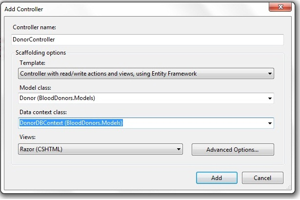
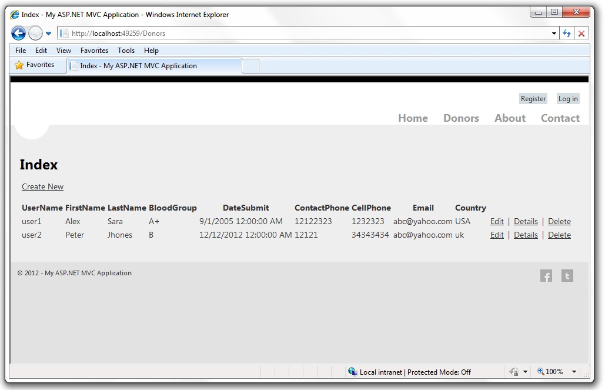

# Locate Blood Donors using Online Maps
## Requires
- Visual Studio 2010
## License
- Apache License, Version 2.0
## Technologies
- ASP.NET MVC
- jQuery
- ASP.NET MVC 4
## Topics
- ASP.NET MVC
- HTML5
## Updated
- 05/02/2019
## Description

<h1>&nbsp;Introduction</h1>

This guide&nbsp;will help you&nbsp;to&nbsp;use Web Mapping (APIs) and link it to the database that supports creating, editing, and listing. Below are&nbsp;the screenshots of the application you&rsquo;ll build. It includes a
 page that displays a list of&nbsp;donors and&nbsp;displaying the donor's data&nbsp;on the Maps.

Note: The complete Map Functionality will be&nbsp;available in my next article. Alternatively you can follow this project &#65279;<a href="http://blooddonors.codeplex.com/">here</a>

&nbsp;

<h1>What you'll Build</h1>

You can download the full tutorial <a href="http://blooddonors.codeplex.com/">
here</a>.

&nbsp;

Description

The&nbsp;Source code is written in C#, CSHTML and JavaScripts is also used in some pages. Microsoft Bing Mapping AJAX API ver 7.0 is used to provide mapping functionality.&nbsp;The purpose of this project is to&nbsp;demonstrate
 the integration of the MVC4 with the BING Map API. The Partial view is used o reduce the code. The Project is designed in Visual Studio 11, ASP.NET MVC 4 and uses Razor view engine with Microsoft SQL Compact. Microsoft Bing Mapping AJAX API ver 7.0 is used
 to provide mapping functionality.&nbsp;The&nbsp;code-first development workflow is used in the Entity Framework 4.5. The purpose of this project is to&nbsp;create a website for&nbsp;locate a particular blood group donor in your&nbsp;area, the users will be
 able to locate a nearest donors using&nbsp;hand held&nbsp;devices.

<h1>Getting Started</h1>

Start by running Visual Web Developer 2011 Express&nbsp;and select
<strong>New Project</strong> from the <strong>Start</strong> page.

<strong>Step- 1 Creating Your First Application</strong>

<strong>&nbsp;</strong>You can create applications using either Visual Basic or Visual C# as the programming language. Select Visual C# on the left and then select
<strong>ASP.NET MVC&nbsp;4 Web Application</strong>. Name your project &quot;BloodDonors&quot; and then click
<strong>OK</strong>.

In the <strong>New ASP.NET MVC&nbsp;4 Project</strong> dialog box, select
<strong>Internet Application</strong>. and use <strong>Razor</strong> as the default view engine.

It will create the <strong>Controller, Model</strong> and
<strong>View</strong> folder in your project and also some other required files.

<strong>Step -2 Create The Model Class</strong>

<strong>&nbsp;</strong><em>First We will Create a Donor Class. right Click the Model Folder and Click Add - &gt;New Item.
</em><em>Add MVC4 Controller Class and name it Donor.cs and paste the following code in it.</em>

C#

Edit|Remove

csharp
<pre class="hidden">using System;
using System.ComponentModel.DataAnnotations;
using System.Linq;
using System.Web.Mvc;

namespace BloodDonors.Models
{
    public class Donor
    {
        [HiddenInput(DisplayValue = false)]
        public int DonorID { get; set; }
        public string FirstName { get; set; }
        public string LastName { get; set; }
        public string BloodGroup { get; set; }
        public string Title { get; set; }
        public DateTime DateSubmit { get; set; }
        public string Description { get; set; }
        public string ContactPhone { get; set; }
        public string CellPhone { get; set; }
        public string Email { get; set; }
        public string Address { get; set; }
        public string Country { get; set; }
               public double Latitude { get; set; }
               public double Longitude { get; set; }

        [UIHint(&quot;LocationDetail&quot;)]
        [NotMapped]
        public LocationDetail Location
        {
            get
            {
                return new LocationDetail() { Latitude = this.Latitude, Longitude = this.Longitude, Title = this.Title, Address = this.Address };
            }
            set
            {
                this.Latitude = value.Latitude;
                this.Longitude = value.Longitude;
                this.Title = value.Title;
                this.Address = value.Address;
            }
        }
    }

    public class LocationDetail
    {
        public double Latitude;
        public double Longitude;
        public string Title;
        public string Address;
    }
    }
</pre>

<pre class="csharp">using&nbsp;System;&nbsp;
using&nbsp;System.ComponentModel.DataAnnotations;&nbsp;
using&nbsp;System.Linq;&nbsp;
using&nbsp;System.Web.Mvc;&nbsp;
&nbsp;
namespace&nbsp;BloodDonors.Models&nbsp;
{&nbsp;
&nbsp;&nbsp;&nbsp;&nbsp;public&nbsp;class&nbsp;Donor&nbsp;
&nbsp;&nbsp;&nbsp;&nbsp;{&nbsp;
&nbsp;&nbsp;&nbsp;&nbsp;&nbsp;&nbsp;&nbsp;&nbsp;[HiddenInput(DisplayValue&nbsp;=&nbsp;false)]&nbsp;
&nbsp;&nbsp;&nbsp;&nbsp;&nbsp;&nbsp;&nbsp;&nbsp;public&nbsp;int&nbsp;DonorID&nbsp;{&nbsp;get;&nbsp;set;&nbsp;}&nbsp;
&nbsp;&nbsp;&nbsp;&nbsp;&nbsp;&nbsp;&nbsp;&nbsp;public&nbsp;string&nbsp;FirstName&nbsp;{&nbsp;get;&nbsp;set;&nbsp;}&nbsp;
&nbsp;&nbsp;&nbsp;&nbsp;&nbsp;&nbsp;&nbsp;&nbsp;public&nbsp;string&nbsp;LastName&nbsp;{&nbsp;get;&nbsp;set;&nbsp;}&nbsp;
&nbsp;&nbsp;&nbsp;&nbsp;&nbsp;&nbsp;&nbsp;&nbsp;public&nbsp;string&nbsp;BloodGroup&nbsp;{&nbsp;get;&nbsp;set;&nbsp;}&nbsp;
&nbsp;&nbsp;&nbsp;&nbsp;&nbsp;&nbsp;&nbsp;&nbsp;public&nbsp;string&nbsp;Title&nbsp;{&nbsp;get;&nbsp;set;&nbsp;}&nbsp;
&nbsp;&nbsp;&nbsp;&nbsp;&nbsp;&nbsp;&nbsp;&nbsp;public&nbsp;DateTime&nbsp;DateSubmit&nbsp;{&nbsp;get;&nbsp;set;&nbsp;}&nbsp;
&nbsp;&nbsp;&nbsp;&nbsp;&nbsp;&nbsp;&nbsp;&nbsp;public&nbsp;string&nbsp;Description&nbsp;{&nbsp;get;&nbsp;set;&nbsp;}&nbsp;
&nbsp;&nbsp;&nbsp;&nbsp;&nbsp;&nbsp;&nbsp;&nbsp;public&nbsp;string&nbsp;ContactPhone&nbsp;{&nbsp;get;&nbsp;set;&nbsp;}&nbsp;
&nbsp;&nbsp;&nbsp;&nbsp;&nbsp;&nbsp;&nbsp;&nbsp;public&nbsp;string&nbsp;CellPhone&nbsp;{&nbsp;get;&nbsp;set;&nbsp;}&nbsp;
&nbsp;&nbsp;&nbsp;&nbsp;&nbsp;&nbsp;&nbsp;&nbsp;public&nbsp;string&nbsp;Email&nbsp;{&nbsp;get;&nbsp;set;&nbsp;}&nbsp;
&nbsp;&nbsp;&nbsp;&nbsp;&nbsp;&nbsp;&nbsp;&nbsp;public&nbsp;string&nbsp;Address&nbsp;{&nbsp;get;&nbsp;set;&nbsp;}&nbsp;
&nbsp;&nbsp;&nbsp;&nbsp;&nbsp;&nbsp;&nbsp;&nbsp;public&nbsp;string&nbsp;Country&nbsp;{&nbsp;get;&nbsp;set;&nbsp;}&nbsp;
&nbsp;&nbsp;&nbsp;&nbsp;&nbsp;&nbsp;&nbsp;&nbsp;&nbsp;&nbsp;&nbsp;&nbsp;&nbsp;&nbsp;&nbsp;public&nbsp;double&nbsp;Latitude&nbsp;{&nbsp;get;&nbsp;set;&nbsp;}&nbsp;
&nbsp;&nbsp;&nbsp;&nbsp;&nbsp;&nbsp;&nbsp;&nbsp;&nbsp;&nbsp;&nbsp;&nbsp;&nbsp;&nbsp;&nbsp;public&nbsp;double&nbsp;Longitude&nbsp;{&nbsp;get;&nbsp;set;&nbsp;}&nbsp;
&nbsp;
&nbsp;&nbsp;&nbsp;&nbsp;&nbsp;&nbsp;&nbsp;&nbsp;[UIHint(&quot;LocationDetail&quot;)]&nbsp;
&nbsp;&nbsp;&nbsp;&nbsp;&nbsp;&nbsp;&nbsp;&nbsp;[NotMapped]&nbsp;
&nbsp;&nbsp;&nbsp;&nbsp;&nbsp;&nbsp;&nbsp;&nbsp;public&nbsp;LocationDetail&nbsp;Location&nbsp;
&nbsp;&nbsp;&nbsp;&nbsp;&nbsp;&nbsp;&nbsp;&nbsp;{&nbsp;
&nbsp;&nbsp;&nbsp;&nbsp;&nbsp;&nbsp;&nbsp;&nbsp;&nbsp;&nbsp;&nbsp;&nbsp;get&nbsp;
&nbsp;&nbsp;&nbsp;&nbsp;&nbsp;&nbsp;&nbsp;&nbsp;&nbsp;&nbsp;&nbsp;&nbsp;{&nbsp;
&nbsp;&nbsp;&nbsp;&nbsp;&nbsp;&nbsp;&nbsp;&nbsp;&nbsp;&nbsp;&nbsp;&nbsp;&nbsp;&nbsp;&nbsp;&nbsp;return&nbsp;new&nbsp;LocationDetail()&nbsp;{&nbsp;Latitude&nbsp;=&nbsp;this.Latitude,&nbsp;Longitude&nbsp;=&nbsp;this.Longitude,&nbsp;Title&nbsp;=&nbsp;this.Title,&nbsp;Address&nbsp;=&nbsp;this.Address&nbsp;};&nbsp;
&nbsp;&nbsp;&nbsp;&nbsp;&nbsp;&nbsp;&nbsp;&nbsp;&nbsp;&nbsp;&nbsp;&nbsp;}&nbsp;
&nbsp;&nbsp;&nbsp;&nbsp;&nbsp;&nbsp;&nbsp;&nbsp;&nbsp;&nbsp;&nbsp;&nbsp;set&nbsp;
&nbsp;&nbsp;&nbsp;&nbsp;&nbsp;&nbsp;&nbsp;&nbsp;&nbsp;&nbsp;&nbsp;&nbsp;{&nbsp;
&nbsp;&nbsp;&nbsp;&nbsp;&nbsp;&nbsp;&nbsp;&nbsp;&nbsp;&nbsp;&nbsp;&nbsp;&nbsp;&nbsp;&nbsp;&nbsp;this.Latitude&nbsp;=&nbsp;value.Latitude;&nbsp;
&nbsp;&nbsp;&nbsp;&nbsp;&nbsp;&nbsp;&nbsp;&nbsp;&nbsp;&nbsp;&nbsp;&nbsp;&nbsp;&nbsp;&nbsp;&nbsp;this.Longitude&nbsp;=&nbsp;value.Longitude;&nbsp;
&nbsp;&nbsp;&nbsp;&nbsp;&nbsp;&nbsp;&nbsp;&nbsp;&nbsp;&nbsp;&nbsp;&nbsp;&nbsp;&nbsp;&nbsp;&nbsp;this.Title&nbsp;=&nbsp;value.Title;&nbsp;
&nbsp;&nbsp;&nbsp;&nbsp;&nbsp;&nbsp;&nbsp;&nbsp;&nbsp;&nbsp;&nbsp;&nbsp;&nbsp;&nbsp;&nbsp;&nbsp;this.Address&nbsp;=&nbsp;value.Address;&nbsp;
&nbsp;&nbsp;&nbsp;&nbsp;&nbsp;&nbsp;&nbsp;&nbsp;&nbsp;&nbsp;&nbsp;&nbsp;}&nbsp;
&nbsp;&nbsp;&nbsp;&nbsp;&nbsp;&nbsp;&nbsp;&nbsp;}&nbsp;
&nbsp;&nbsp;&nbsp;&nbsp;}&nbsp;
&nbsp;
&nbsp;&nbsp;&nbsp;&nbsp;public&nbsp;class&nbsp;LocationDetail&nbsp;
&nbsp;&nbsp;&nbsp;&nbsp;{&nbsp;
&nbsp;&nbsp;&nbsp;&nbsp;&nbsp;&nbsp;&nbsp;&nbsp;public&nbsp;double&nbsp;Latitude;&nbsp;
&nbsp;&nbsp;&nbsp;&nbsp;&nbsp;&nbsp;&nbsp;&nbsp;public&nbsp;double&nbsp;Longitude;&nbsp;
&nbsp;&nbsp;&nbsp;&nbsp;&nbsp;&nbsp;&nbsp;&nbsp;public&nbsp;string&nbsp;Title;&nbsp;
&nbsp;&nbsp;&nbsp;&nbsp;&nbsp;&nbsp;&nbsp;&nbsp;public&nbsp;string&nbsp;Address;&nbsp;
&nbsp;&nbsp;&nbsp;&nbsp;}&nbsp;
&nbsp;&nbsp;&nbsp;&nbsp;}&nbsp;
</pre>

Donor.cs

<strong>Step-3 Create DataBase Context Class</strong>

The main class that coordinates Entity Framework functionality for a given data model is the
<em>database context</em> class. You create this class by deriving from the System.Data.Entity.DbContext class. In your code you specify which entities are included in the data model. You can also customize certain Entity Framework behaviour. In the code for
 this project, the class is named <strong>DonorDBContext.cs</strong>

<em>Create a
<em>DAL</em> folder. In that folder create a new class file named <em>DonorDBContext.cs</em>, and replace the existing code with the following code</em><em>.</em>

<em>&nbsp;</em>&nbsp;In the DAL folder, create a new class file name DonorInitializer.cs replace the existing code
 with the following code, which causes a database to be created when needed and loads test data into the new database

<h1 class="scriptcode" style="text-align:left"><strong>

C#

Edit|Remove

csharp
<pre class="hidden">using System;
using System.Collections.Generic;
using System.Data.Entity;
using BloodDonors.Models;
using System.Data.Entity.ModelConfiguration.Conventions;

namespace BloodDonors.Models
{
    public class DonorDBContext : DbContext
    {
        public DbSet&lt;Donor&gt; Donor { get; set; }

        protected override void OnModelCreating(DbModelBuilder modelBuilder)
        {
            modelBuilder.Conventions.Remove&lt;PluralizingTableNameConvention&gt;();
        }
    }
}</pre>

<pre class="csharp">using&nbsp;System;&nbsp;
using&nbsp;System.Collections.Generic;&nbsp;
using&nbsp;System.Data.Entity;&nbsp;
using&nbsp;BloodDonors.Models;&nbsp;
using&nbsp;System.Data.Entity.ModelConfiguration.Conventions;&nbsp;
&nbsp;
namespace&nbsp;BloodDonors.Models&nbsp;
{&nbsp;
&nbsp;&nbsp;&nbsp;&nbsp;public&nbsp;class&nbsp;DonorDBContext&nbsp;:&nbsp;DbContext&nbsp;
&nbsp;&nbsp;&nbsp;&nbsp;{&nbsp;
&nbsp;&nbsp;&nbsp;&nbsp;&nbsp;&nbsp;&nbsp;&nbsp;public&nbsp;DbSet&lt;Donor&gt;&nbsp;Donor&nbsp;{&nbsp;get;&nbsp;set;&nbsp;}&nbsp;
&nbsp;
&nbsp;&nbsp;&nbsp;&nbsp;&nbsp;&nbsp;&nbsp;&nbsp;protected&nbsp;override&nbsp;void&nbsp;OnModelCreating(DbModelBuilder&nbsp;modelBuilder)&nbsp;
&nbsp;&nbsp;&nbsp;&nbsp;&nbsp;&nbsp;&nbsp;&nbsp;{&nbsp;
&nbsp;&nbsp;&nbsp;&nbsp;&nbsp;&nbsp;&nbsp;&nbsp;&nbsp;&nbsp;&nbsp;&nbsp;modelBuilder.Conventions.Remove&lt;PluralizingTableNameConvention&gt;();&nbsp;
&nbsp;&nbsp;&nbsp;&nbsp;&nbsp;&nbsp;&nbsp;&nbsp;}&nbsp;
&nbsp;&nbsp;&nbsp;&nbsp;}&nbsp;
}</pre>

&nbsp;

</strong></h1>
<h1 class="scriptcode" style="text-align:left"><strong>Step-4 Initializing the database with test data</strong></h1>

In the DAL Folder, create a new class file name DonorInitializer.cs and replace the existing code with the following code, which causes the database to be created when needed and loads the test data into
 the new database.

C#

Edit|Remove

csharp
<pre class="hidden">using System;
using System.Collections.Generic;
using System.Linq;
using System.Web;
using System.Data.Entity; 
using BloodDonors.Models;

namespace BloodDonors.DAL
{
    public class DonorInitializer : DropCreateDatabaseIfModelChanges&lt;DonorDBContext&gt;
    {
        protected override void Seed(DonorDBContext context)
        {
            var donors = new List&lt;Donor&gt; 
            { 
                new Donor { FirstName = &quot;A&quot;, LastName = &quot;Sara&quot;, Title = &quot;First Donor&quot;, BloodGroup = &quot;A&#43;&quot;, Description = &quot;test description-1&quot;, DateSubmit = DateTime.Parse(&quot;2005-09-01&quot;), ContactPhone =&quot;12122323&quot;, Address = &quot;Address-1&quot;, Country =&quot;USA&quot;  }, 
           
            };
            donors.ForEach(s =&gt; context.Donor.Add(s));
            context.SaveChanges();

        }
    }
}</pre>

<pre class="csharp">using&nbsp;System;&nbsp;
using&nbsp;System.Collections.Generic;&nbsp;
using&nbsp;System.Linq;&nbsp;
using&nbsp;System.Web;&nbsp;
using&nbsp;System.Data.Entity;&nbsp;&nbsp;
using&nbsp;BloodDonors.Models;&nbsp;
&nbsp;
namespace&nbsp;BloodDonors.DAL&nbsp;
{&nbsp;
&nbsp;&nbsp;&nbsp;&nbsp;public&nbsp;class&nbsp;DonorInitializer&nbsp;:&nbsp;DropCreateDatabaseIfModelChanges&lt;DonorDBContext&gt;&nbsp;
&nbsp;&nbsp;&nbsp;&nbsp;{&nbsp;
&nbsp;&nbsp;&nbsp;&nbsp;&nbsp;&nbsp;&nbsp;&nbsp;protected&nbsp;override&nbsp;void&nbsp;Seed(DonorDBContext&nbsp;context)&nbsp;
&nbsp;&nbsp;&nbsp;&nbsp;&nbsp;&nbsp;&nbsp;&nbsp;{&nbsp;
&nbsp;&nbsp;&nbsp;&nbsp;&nbsp;&nbsp;&nbsp;&nbsp;&nbsp;&nbsp;&nbsp;&nbsp;var&nbsp;donors&nbsp;=&nbsp;new&nbsp;List&lt;Donor&gt;&nbsp;&nbsp;
&nbsp;&nbsp;&nbsp;&nbsp;&nbsp;&nbsp;&nbsp;&nbsp;&nbsp;&nbsp;&nbsp;&nbsp;{&nbsp;&nbsp;
&nbsp;&nbsp;&nbsp;&nbsp;&nbsp;&nbsp;&nbsp;&nbsp;&nbsp;&nbsp;&nbsp;&nbsp;&nbsp;&nbsp;&nbsp;&nbsp;new&nbsp;Donor&nbsp;{&nbsp;FirstName&nbsp;=&nbsp;&quot;A&quot;,&nbsp;LastName&nbsp;=&nbsp;&quot;Sara&quot;,&nbsp;Title&nbsp;=&nbsp;&quot;First&nbsp;Donor&quot;,&nbsp;BloodGroup&nbsp;=&nbsp;&quot;A&#43;&quot;,&nbsp;Description&nbsp;=&nbsp;&quot;test&nbsp;description-1&quot;,&nbsp;DateSubmit&nbsp;=&nbsp;DateTime.Parse(&quot;2005-09-01&quot;),&nbsp;ContactPhone&nbsp;=&quot;12122323&quot;,&nbsp;Address&nbsp;=&nbsp;&quot;Address-1&quot;,&nbsp;Country&nbsp;=&quot;USA&quot;&nbsp;&nbsp;},&nbsp;&nbsp;
&nbsp;&nbsp;&nbsp;&nbsp;&nbsp;&nbsp;&nbsp;&nbsp;&nbsp;&nbsp;&nbsp;&nbsp;
&nbsp;&nbsp;&nbsp;&nbsp;&nbsp;&nbsp;&nbsp;&nbsp;&nbsp;&nbsp;&nbsp;&nbsp;};&nbsp;
&nbsp;&nbsp;&nbsp;&nbsp;&nbsp;&nbsp;&nbsp;&nbsp;&nbsp;&nbsp;&nbsp;&nbsp;donors.ForEach(s&nbsp;=&gt;&nbsp;context.Donor.Add(s));&nbsp;
&nbsp;&nbsp;&nbsp;&nbsp;&nbsp;&nbsp;&nbsp;&nbsp;&nbsp;&nbsp;&nbsp;&nbsp;context.SaveChanges();&nbsp;
&nbsp;
&nbsp;&nbsp;&nbsp;&nbsp;&nbsp;&nbsp;&nbsp;&nbsp;}&nbsp;
&nbsp;&nbsp;&nbsp;&nbsp;}&nbsp;
}</pre>

&nbsp;

&nbsp;

Make the following changes in the Global.asax.cs file to cause this initializer code to run when the application begins.

&nbsp;

Add the following <strong>using statements:</strong>

<strong>

C#

Edit|Remove

csharp
<pre class="hidden">using System.Data.Entity;
using BloodDonors.Models;
using BloodDonors.DAL;</pre>

<pre class="css">using&nbsp;System.Data.Entity;&nbsp;
using&nbsp;BloodDonors.Models;&nbsp;
using&nbsp;BloodDonors.DAL;</pre>

</strong>

In the Application_Start method, call an Entity Framework method that runs the database initializer code:&nbsp;

&nbsp;

C#

Edit|Remove

csharp
<pre class="hidden">Database.SetInitializer&lt;DonorDBContext&gt;(new DonorInitializer());</pre>

<pre class="css">Database.SetInitializer&lt;DonorDBContext&gt;(new&nbsp;DonorInitializer());</pre>

Note: When you deploy an application to a production web server, you must remove this code that seeds the database.

<h1>Step-5&nbsp;Add a Controller<em>&nbsp;</em></h1>
<h1 class="scriptcode">Right-Click the Controller folder and create a new <strong>
DonorsController.</strong></h1>

<strong></strong>

Click <strong>Add</strong>. Visual Web Developer creates the following files and folders:

<ul>
<li><em>A DonorController.cs</em> file in the project's <em>Controllers</em> folder.
</li><li>A <em>Donors</em> folder in the project's <em>Views</em> folder. </li><li><em>Create.cshtml, Delete.cshtml, Details.cshtml, Edit.cshtml</em>, and <em>Index.cshtml</em> in the new
<em>Views\Donors </em>folder. </li></ul>

Run the application and browse to the Donors controller by appending <em>/Donors</em> to the URL in the address bar of your browser

<em>For more information and complete source code&nbsp;, see
<a href="http://blooddonors.codeplex.com/">http://blooddonors.codeplex.com/</a></em>

&nbsp;

&nbsp;

&nbsp;

&nbsp;

&nbsp;

&nbsp;

