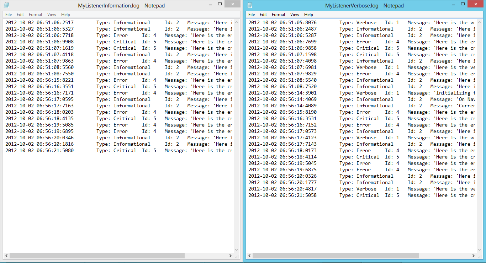

# Logging Sample for Windows Store Apps (ETW Logging in WinRT)
## Requires
- Visual Studio 2012
## License
- Apache License, Version 2.0
## Technologies
- C#
- XAML
- Visual Basic .NET
- Windows RT
## Topics
- C#
- Diagnostics
- XAML
- Visual Basic .NET
- Windows RT
- ETW
- StorageFile Logging
## Updated
- 10/10/2012
## Description

<h1>Introduction</h1>

One of the biggest issues with Windows Store Apps (aka Metro Applications) was the removal of the TraceListeners from the windows runtime. Log4Net community has not yet took a step forward to port at least some of the functionality to .NET for Windows Store
 Apps Framework either. So most of the developers were complaining about the lack of logging functionality in WinRT.

Here is a small sample that shows how to use the ETW (Event Tracing for Windows) namespaces to write application events to a storage file on the application local storage.

 

Description

<a class="libraryLink" href="http://msdn.microsoft.com/en-US/library/System.Diagnostics.aspx" target="_blank" title="Auto generated link to System.Diagnostics">System.Diagnostics</a> and its child namespaces (<a class="libraryLink" href="http://msdn.microsoft.com/en-US/library/System.Diagnostics.CodeAnalysis.aspx" target="_blank" title="Auto generated link to System.Diagnostics.CodeAnalysis">System.Diagnostics.CodeAnalysis</a>,
<a class="libraryLink" href="http://msdn.microsoft.com/en-US/library/System.Diagnostics.Contracts.aspx" target="_blank" title="Auto generated link to System.Diagnostics.Contracts">System.Diagnostics.Contracts</a>, and 
<a class="libraryLink" href="http://msdn.microsoft.com/en-US/library/System.Diagnostics.Tracing.aspx" target="_blank" title="Auto generated link to System.Diagnostics.Tracing">System.Diagnostics.Tracing</a>) contain types that enable you to interact with system processes, event logs, and performance counters.

With the help of the Tracing namespace, we can define a simple EventSource to send diffent type of events in different severities.

&nbsp;

C#

Edit|Remove

csharp

<pre class="csharp">&nbsp;&nbsp;&nbsp;&nbsp;sealed&nbsp;class&nbsp;MetroEventSource&nbsp;:&nbsp;EventSource&nbsp;
&nbsp;&nbsp;&nbsp;&nbsp;{&nbsp;
&nbsp;&nbsp;&nbsp;&nbsp;&nbsp;&nbsp;&nbsp;&nbsp;public&nbsp;static&nbsp;MetroEventSource&nbsp;Log&nbsp;=&nbsp;new&nbsp;MetroEventSource();&nbsp;
&nbsp;
&nbsp;&nbsp;&nbsp;&nbsp;&nbsp;&nbsp;&nbsp;&nbsp;[Event(1,&nbsp;Level&nbsp;=&nbsp;EventLevel.Verbose)]&nbsp;
&nbsp;&nbsp;&nbsp;&nbsp;&nbsp;&nbsp;&nbsp;&nbsp;public&nbsp;void&nbsp;Debug(string&nbsp;message)&nbsp;
&nbsp;&nbsp;&nbsp;&nbsp;&nbsp;&nbsp;&nbsp;&nbsp;{&nbsp;
&nbsp;&nbsp;&nbsp;&nbsp;&nbsp;&nbsp;&nbsp;&nbsp;&nbsp;&nbsp;&nbsp;&nbsp;this.WriteEvent(1,&nbsp;message);&nbsp;
&nbsp;&nbsp;&nbsp;&nbsp;&nbsp;&nbsp;&nbsp;&nbsp;}&nbsp;
&nbsp;
&nbsp;&nbsp;&nbsp;&nbsp;&nbsp;&nbsp;&nbsp;&nbsp;[Event(2,&nbsp;Level&nbsp;=&nbsp;EventLevel.Informational)]&nbsp;
&nbsp;&nbsp;&nbsp;&nbsp;&nbsp;&nbsp;&nbsp;&nbsp;public&nbsp;void&nbsp;Info(string&nbsp;message)&nbsp;
&nbsp;&nbsp;&nbsp;&nbsp;&nbsp;&nbsp;&nbsp;&nbsp;{&nbsp;
&nbsp;&nbsp;&nbsp;&nbsp;&nbsp;&nbsp;&nbsp;&nbsp;&nbsp;&nbsp;&nbsp;&nbsp;this.WriteEvent(2,&nbsp;message);&nbsp;
&nbsp;&nbsp;&nbsp;&nbsp;&nbsp;&nbsp;&nbsp;&nbsp;}&nbsp;
&nbsp;
&nbsp;&nbsp;&nbsp;&nbsp;&nbsp;&nbsp;&nbsp;&nbsp;[Event(3,&nbsp;Level&nbsp;=&nbsp;EventLevel.Warning)]&nbsp;
&nbsp;&nbsp;&nbsp;&nbsp;&nbsp;&nbsp;&nbsp;&nbsp;public&nbsp;void&nbsp;Warn(string&nbsp;message)&nbsp;
&nbsp;&nbsp;&nbsp;&nbsp;&nbsp;&nbsp;&nbsp;&nbsp;{&nbsp;
&nbsp;&nbsp;&nbsp;&nbsp;&nbsp;&nbsp;&nbsp;&nbsp;&nbsp;&nbsp;&nbsp;&nbsp;this.WriteEvent(3,&nbsp;message);&nbsp;
&nbsp;&nbsp;&nbsp;&nbsp;&nbsp;&nbsp;&nbsp;&nbsp;}&nbsp;
&nbsp;
&nbsp;&nbsp;&nbsp;&nbsp;&nbsp;&nbsp;&nbsp;&nbsp;[Event(4,&nbsp;Level&nbsp;=&nbsp;EventLevel.Error)]&nbsp;
&nbsp;&nbsp;&nbsp;&nbsp;&nbsp;&nbsp;&nbsp;&nbsp;public&nbsp;void&nbsp;Error(string&nbsp;message)&nbsp;
&nbsp;&nbsp;&nbsp;&nbsp;&nbsp;&nbsp;&nbsp;&nbsp;{&nbsp;
&nbsp;&nbsp;&nbsp;&nbsp;&nbsp;&nbsp;&nbsp;&nbsp;&nbsp;&nbsp;&nbsp;&nbsp;this.WriteEvent(4,&nbsp;message);&nbsp;
&nbsp;&nbsp;&nbsp;&nbsp;&nbsp;&nbsp;&nbsp;&nbsp;}&nbsp;
&nbsp;
&nbsp;&nbsp;&nbsp;&nbsp;&nbsp;&nbsp;&nbsp;&nbsp;[Event(5,&nbsp;Level&nbsp;=&nbsp;EventLevel.Critical)]&nbsp;
&nbsp;&nbsp;&nbsp;&nbsp;&nbsp;&nbsp;&nbsp;&nbsp;public&nbsp;void&nbsp;Critical(string&nbsp;message)&nbsp;
&nbsp;&nbsp;&nbsp;&nbsp;&nbsp;&nbsp;&nbsp;&nbsp;{&nbsp;
&nbsp;&nbsp;&nbsp;&nbsp;&nbsp;&nbsp;&nbsp;&nbsp;&nbsp;&nbsp;&nbsp;&nbsp;this.WriteEvent(5,&nbsp;message);&nbsp;
&nbsp;&nbsp;&nbsp;&nbsp;&nbsp;&nbsp;&nbsp;&nbsp;}&nbsp;
&nbsp;&nbsp;&nbsp;&nbsp;}</pre>

After creating our event source we will need a event listener that simply creates either opens an existing file in the local storage:

&nbsp;

C#

Edit|Remove

csharp

<pre class="csharp">&nbsp;&nbsp;&nbsp;&nbsp;///&nbsp;&lt;summary&gt;&nbsp;
&nbsp;&nbsp;&nbsp;&nbsp;///&nbsp;This&nbsp;is&nbsp;an&nbsp;advanced&nbsp;usage,&nbsp;where&nbsp;you&nbsp;want&nbsp;to&nbsp;intercept&nbsp;the&nbsp;logging&nbsp;messages&nbsp;and&nbsp;devert&nbsp;them&nbsp;somewhere&nbsp;
&nbsp;&nbsp;&nbsp;&nbsp;///&nbsp;besides&nbsp;ETW.&nbsp;
&nbsp;&nbsp;&nbsp;&nbsp;///&nbsp;&lt;/summary&gt;&nbsp;
&nbsp;&nbsp;&nbsp;&nbsp;sealed&nbsp;class&nbsp;StorageFileEventListener&nbsp;:&nbsp;EventListener&nbsp;
&nbsp;&nbsp;&nbsp;&nbsp;{&nbsp;
&nbsp;&nbsp;&nbsp;&nbsp;&nbsp;&nbsp;&nbsp;&nbsp;///&nbsp;&lt;summary&gt;&nbsp;
&nbsp;&nbsp;&nbsp;&nbsp;&nbsp;&nbsp;&nbsp;&nbsp;///&nbsp;Storage&nbsp;file&nbsp;to&nbsp;be&nbsp;used&nbsp;to&nbsp;write&nbsp;logs&nbsp;
&nbsp;&nbsp;&nbsp;&nbsp;&nbsp;&nbsp;&nbsp;&nbsp;///&nbsp;&lt;/summary&gt;&nbsp;
&nbsp;&nbsp;&nbsp;&nbsp;&nbsp;&nbsp;&nbsp;&nbsp;private&nbsp;StorageFile&nbsp;m_StorageFile&nbsp;=&nbsp;null;&nbsp;
&nbsp;
&nbsp;&nbsp;&nbsp;&nbsp;&nbsp;&nbsp;&nbsp;&nbsp;///&nbsp;&lt;summary&gt;&nbsp;
&nbsp;&nbsp;&nbsp;&nbsp;&nbsp;&nbsp;&nbsp;&nbsp;///&nbsp;Name&nbsp;of&nbsp;the&nbsp;current&nbsp;event&nbsp;listener&nbsp;
&nbsp;&nbsp;&nbsp;&nbsp;&nbsp;&nbsp;&nbsp;&nbsp;///&nbsp;&lt;/summary&gt;&nbsp;
&nbsp;&nbsp;&nbsp;&nbsp;&nbsp;&nbsp;&nbsp;&nbsp;private&nbsp;string&nbsp;m_Name;&nbsp;
&nbsp;
&nbsp;&nbsp;&nbsp;&nbsp;&nbsp;&nbsp;&nbsp;&nbsp;public&nbsp;StorageFileEventListener(string&nbsp;name)&nbsp;
&nbsp;&nbsp;&nbsp;&nbsp;&nbsp;&nbsp;&nbsp;&nbsp;{&nbsp;
&nbsp;&nbsp;&nbsp;&nbsp;&nbsp;&nbsp;&nbsp;&nbsp;&nbsp;&nbsp;&nbsp;&nbsp;this.m_Name&nbsp;=&nbsp;name;&nbsp;
&nbsp;
&nbsp;&nbsp;&nbsp;&nbsp;&nbsp;&nbsp;&nbsp;&nbsp;&nbsp;&nbsp;&nbsp;&nbsp;Debug.WriteLine(&quot;StorageFileEventListener&nbsp;for&nbsp;{0}&nbsp;has&nbsp;name&nbsp;{1}&quot;,&nbsp;GetHashCode(),&nbsp;name);&nbsp;
&nbsp;
&nbsp;&nbsp;&nbsp;&nbsp;&nbsp;&nbsp;&nbsp;&nbsp;&nbsp;&nbsp;&nbsp;&nbsp;AssignLocalFile();&nbsp;
&nbsp;&nbsp;&nbsp;&nbsp;&nbsp;&nbsp;&nbsp;&nbsp;}&nbsp;
&nbsp;
&nbsp;&nbsp;&nbsp;&nbsp;&nbsp;&nbsp;&nbsp;&nbsp;private&nbsp;async&nbsp;void&nbsp;AssignLocalFile()&nbsp;
&nbsp;&nbsp;&nbsp;&nbsp;&nbsp;&nbsp;&nbsp;&nbsp;{&nbsp;
&nbsp;&nbsp;&nbsp;&nbsp;&nbsp;&nbsp;&nbsp;&nbsp;&nbsp;&nbsp;&nbsp;&nbsp;m_StorageFile&nbsp;=&nbsp;await&nbsp;ApplicationData.Current.LocalFolder.CreateFileAsync(m_Name.Replace(&quot;&nbsp;&quot;,&nbsp;&quot;_&quot;)&nbsp;&#43;&nbsp;&quot;.log&quot;,&nbsp;
&nbsp;&nbsp;&nbsp;&nbsp;&nbsp;&nbsp;&nbsp;&nbsp;&nbsp;&nbsp;&nbsp;&nbsp;&nbsp;&nbsp;&nbsp;&nbsp;&nbsp;&nbsp;&nbsp;&nbsp;&nbsp;&nbsp;&nbsp;&nbsp;&nbsp;&nbsp;&nbsp;&nbsp;&nbsp;&nbsp;&nbsp;&nbsp;&nbsp;&nbsp;&nbsp;&nbsp;&nbsp;&nbsp;&nbsp;&nbsp;&nbsp;&nbsp;&nbsp;&nbsp;&nbsp;&nbsp;&nbsp;&nbsp;&nbsp;&nbsp;&nbsp;&nbsp;&nbsp;&nbsp;&nbsp;&nbsp;&nbsp;&nbsp;&nbsp;&nbsp;&nbsp;&nbsp;&nbsp;&nbsp;&nbsp;&nbsp;&nbsp;&nbsp;&nbsp;&nbsp;&nbsp;&nbsp;&nbsp;&nbsp;&nbsp;&nbsp;&nbsp;&nbsp;&nbsp;&nbsp;&nbsp;&nbsp;&nbsp;&nbsp;&nbsp;&nbsp;CreationCollisionOption.OpenIfExists);&nbsp;
&nbsp;&nbsp;&nbsp;&nbsp;&nbsp;&nbsp;&nbsp;&nbsp;}&nbsp;
&nbsp;
&nbsp;&nbsp;&nbsp;&nbsp;&nbsp;&nbsp;&nbsp;&nbsp;private&nbsp;async&nbsp;void&nbsp;WriteToFile(IEnumerable&lt;string&gt;&nbsp;lines)&nbsp;
&nbsp;&nbsp;&nbsp;&nbsp;&nbsp;&nbsp;&nbsp;&nbsp;{&nbsp;
&nbsp;&nbsp;&nbsp;&nbsp;&nbsp;&nbsp;&nbsp;&nbsp;&nbsp;&nbsp;&nbsp;&nbsp;//&nbsp;TODO:&nbsp;
&nbsp;&nbsp;&nbsp;&nbsp;&nbsp;&nbsp;&nbsp;&nbsp;}&nbsp;
&nbsp;
&nbsp;&nbsp;&nbsp;&nbsp;&nbsp;&nbsp;&nbsp;&nbsp;protected&nbsp;override&nbsp;void&nbsp;OnEventWritten(EventWrittenEventArgs&nbsp;eventData)&nbsp;
&nbsp;&nbsp;&nbsp;&nbsp;&nbsp;&nbsp;&nbsp;&nbsp;{&nbsp;
&nbsp;&nbsp;&nbsp;&nbsp;&nbsp;&nbsp;&nbsp;&nbsp;&nbsp;&nbsp;&nbsp;&nbsp;//&nbsp;TODO:&nbsp;
&nbsp;&nbsp;&nbsp;&nbsp;&nbsp;&nbsp;&nbsp;&nbsp;}&nbsp;
&nbsp;
&nbsp;&nbsp;&nbsp;&nbsp;&nbsp;&nbsp;&nbsp;&nbsp;protected&nbsp;override&nbsp;void&nbsp;OnEventSourceCreated(EventSource&nbsp;eventSource)&nbsp;
&nbsp;&nbsp;&nbsp;&nbsp;&nbsp;&nbsp;&nbsp;&nbsp;{&nbsp;
&nbsp;&nbsp;&nbsp;&nbsp;&nbsp;&nbsp;&nbsp;&nbsp;&nbsp;&nbsp;&nbsp;&nbsp;//&nbsp;TODO:&nbsp;
&nbsp;&nbsp;&nbsp;&nbsp;&nbsp;&nbsp;&nbsp;&nbsp;}&nbsp;
&nbsp;&nbsp;&nbsp;&nbsp;}</pre>

&nbsp;

&nbsp;

and finally initialize the EventListener and start logging:

&nbsp;

C#

Edit|Remove

csharp

<pre class="csharp">&nbsp;&nbsp;&nbsp;&nbsp;//&nbsp;First&nbsp;time&nbsp;execution,&nbsp;initialize&nbsp;the&nbsp;logger&nbsp;
&nbsp;&nbsp;&nbsp;&nbsp;EventListener&nbsp;verboseListener&nbsp;=&nbsp;new&nbsp;StorageFileEventListener(&quot;MyListenerVerbose&quot;);&nbsp;
&nbsp;&nbsp;&nbsp;&nbsp;EventListener&nbsp;informationListener&nbsp;=&nbsp;new&nbsp;StorageFileEventListener(&quot;MyListenerInformation&quot;);&nbsp;
&nbsp;
&nbsp;&nbsp;&nbsp;&nbsp;verboseListener.EnableEvents(MetroEventSource.Log,&nbsp;EventLevel.Verbose);&nbsp;
&nbsp;&nbsp;&nbsp;&nbsp;informationListener.EnableEvents(MetroEventSource.Log,&nbsp;EventLevel.Informational);</pre>

&nbsp;

&nbsp;

the log calls look something like below and the result view of the above defined listeners:

&nbsp;

C#

Edit|Remove

csharp

<pre class="csharp">MetroEventSource.Log.Info(&quot;Current&nbsp;Window&nbsp;is&nbsp;activating&quot;);</pre>

&nbsp;

&nbsp;

&nbsp;

<h1>Source Code Files</h1>
<ul>
<li>

Log\MetroEventSource.cs - This file defines a simple event source to be able to write different types of events to the local storage file.

</li><li>

Log\StorageFileEventListener.cs - Simple storage file listener that makes use of a Semaphore slim to control the access to the storage file.

</li></ul>
<h1>More Information</h1>

<em>Wait for the blog entry on </em><a href="http://canbilgin.wordpress.com/" target="_blank">http://canbilgin.wordpress.com/</a>

