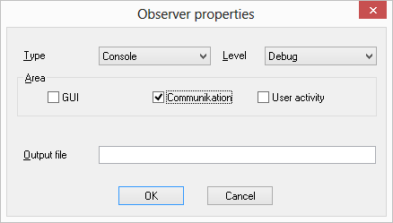
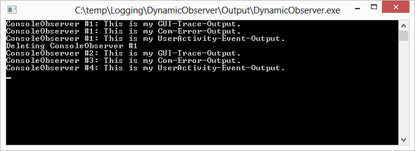

# Logging in a Multithreaded Environment
## Requires
- Visual Studio 2012
## License
- Apache License, Version 2.0
## Technologies
- Multithreading
- C++
- Visual  C++
## Topics
- Multithreading
- Logging
- Observer Pattern
- Singleton Pattern
- std::queue
- Thread Synchronisation
## Updated
- 08/19/2013
## Description

<h1>Introduction</h1>

Having a flexible and dynamic way to log any data at any time asynchronously and in the correct chronological order is very helpful, especially in multi-threaded environments. For example, it provides a convenient way to trace application behaviour. But,
 as with multi-threading itself, one have to consider a few points to get things working as expected.

This sample will show you one way to implement a dynamic, thread-safe, asynchronous, chronological logging mechanism in a multi-threaded environment, using the Observer and the Singleton design patterns, thread synchronisation via semaphores and critical
 sections, and a thread-safe queue based on std::queue. &lsquo;Dynamic&rsquo; means you have the ability to start and stop logging at any time you like and have as many logging destinations as you want (and of course change them at runtime). The architecture
 of the logging mechanism shown in the article is helpful not only in multi-threaded environments, but also in single-threaded ones.

<h1>Using the Sample</h1>

The sample code contains one VS 2012 solution with three projects:

<em>DynamicObserver</em> demonstrates how to implement a single-thread model, how to add and remove log observers during runtime, and how to define a user interface for the administration of log observers.

<em>AsyncDynamicObserver</em> extends the sample code by the multiple-thread implementation described
<a title="Describing Blog Post" href="http://blog.instance-factory.com/?p=181" target="_blank">
in this article</a>.

<em>DistributorMQ</em> decouples even the logging from the distribution to reduce blocking time as much as possible.

All code samples are Windows MFC applications, originally developed under MS Visual C&#43;&#43; 6.0. The code was only modified to compile an run under VS 2012. No newer C&#43;&#43; features were added. The VC&#43;&#43; 6.0 project files are included too.

In case you start one of the demo apps, and no console windows can be seen: just reduce the size of the main window. It might hide the console window that is opened when the application starts. You need the console window to see the output of the console
 observer.

<h2>Show Logging Output</h2>

To receive logging output, you have to configure an observer first. Use <strong>
Observer &gt; Configure &gt; Add</strong>. Please notice that only the Console observer is implemented. Via
<strong>Messages &gt; Generate ...</strong> you can generate logging mesages then, which are displayed in the console window of the application.

<h1>Screenshots</h1>

Observer setup

Single-threaded logging output

Multi-threaded logging output

<h1>More Information</h1>

You can find a detailed description <a title="Describing Blog Post" href="http://blog.instance-factory.com/?p=181" target="_blank">
in this blog post</a>.

<h1>Feedback welcome!</h1>

If you find this material valuable, please rate the sample, and recommend it to your friends and colleagues. If you have any questions, comments, feedback, or bug reports, please use the Q and A tab on this page.

<h1>Building the Sample</h1>
<ol>
<li>Start Visual Studio 2012 and select <strong>File</strong> &gt; <strong>Open</strong> &gt;
<strong>Project/Solution</strong>. </li><li>Go to the directory in which you unzipped the sample. Go to the directory named for the sample, and double-click the Visual Studio 2012 Solution (.sln) file.
</li><li>Press F7 or use <strong>Build</strong> &gt; <strong>Build Solution</strong> to build the sample.
</li></ol>
<h1>Run the sample</h1>

To debug the app and then run it, press F5 or use <strong>Debug</strong> &gt; <strong>
Start Debugging</strong>. To run the app without debugging, press Ctrl&#43;F5 or use <strong>
Debug</strong> &gt; <strong>Start Without Debugging</strong>.

