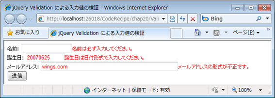

# jQuery Validation でユーザーからの入力値を検証する
## Requires
- 
## License
- Apache License, Version 2.0
## Technologies
- Visual Studio 2010
- jQuery 1.5
## Topics
- 逆引きサンプル コード
- jQuery
## Updated
- 04/11/2011
## Description

執筆者: <a href="http://msdn.microsoft.com/ja-jp/gg585574#yamada" target="_blank">
有限会社 WINGS プロジェクト 山田 祥寛</a>

動作確認環境： Visual Studio 2010、jQuery 1.5

jQuery にはプラグインと呼ばれる追加ライブラリが用意されており、jQuery の基本機能を自在に拡張できます。本稿では、<a href="http://plugins.jquery.com/" target="_blank">あまたあるプラグイン (英語)</a>の中でも代表的な jQuery Validation を例に、プラグインの基本的な用法を解説します。jQuery Validation はその名の通り、フォームからの入力の妥当性検&#35388;をシンプルなコードで実装できるようにしてくれるプラグインです。

jQuery Validation は、以下のページからダウンロードできます。

<ul>
<li><a href="http://bassistance.de/jquery-plugins/jquery-plugin-validation/" target="_blank">jQuery plugin: Validation (英語)</a>
</li></ul>

入手した jquery.validate.min.js は jQuery 本体 (jquery-1.5.min.js) が配置されているのと同じフォルダーに配置するだけです。準備ができたら、具体的なサンプルで jQuery Validation の動作を確認してみましょう。

HTML

スクリプトの編集

html
<pre class="hidden">&lt;!DOCTYPE html&gt;
&lt;html&gt;
&lt;head&gt;
  &lt;title&gt;jQuery Validation による入力値の検&#35388;&lt;/title&gt;
  
&lt;/head&gt;
&lt;body&gt;
&lt;form id=&quot;fm&quot;&gt;
&lt;label&gt;名前：
    &lt;input type=&quot;text&quot; id=&quot;name&quot; name=&quot;name&quot; size=&quot;15&quot; /&gt;&lt;/label&gt;&lt;br /&gt;
&lt;label&gt;誕生日：
    &lt;input type=&quot;text&quot; id=&quot;birth&quot; name=&quot;birth&quot; size=&quot;10&quot; /&gt;&lt;/label&gt;&lt;br /&gt;
&lt;label&gt;メールアドレス：
    &lt;input type=&quot;text&quot; id=&quot;email&quot; name=&quot;email&quot; size=&quot;50&quot; /&gt;&lt;/label&gt;&lt;br /&gt;
&lt;input type=&quot;submit&quot; value=&quot;送信&quot; /&gt;
&lt;/form&gt;

&lt;script src=&quot;../Scripts/jquery-1.5.min.js&quot; type=&quot;text/javascript&quot;&gt;&lt;/script&gt;
&lt;script src=&quot;../Scripts/jquery.validate.min.js&quot; type=&quot;text/javascript&quot;&gt;&lt;/script&gt;
&lt;script type=&quot;text/javascript&quot;&gt;
  // フォーム #fm に対して検&#35388;ルールを登録
$('#fm').validate({
  errorClass: 'invalid',	// エラー メッセージを表示する際に使用するスタイル
   // それぞれの項目に適用される検&#35388;ルール
  rules: {
    'name': {
      required: true,	// 必須検&#35388;
      rangelength: [2, 10]	// 文字列長検&#35388; (2～10文字)
    },
    'birth': { dateISO: true },	// 日付型検&#35388;
    'email': { email: true }	// メールアドレス形式検&#35388;
  },
   // 検&#35388;エラー時に表示されるエラー メッセージ
  messages: {
    'name': {
      required: '名前は必ず入力してください。',
      rangelength: $.format('名前は{0}～{1}文字で入力してください。')
    },
    'birth': { dateISO: '誕生日は日付形式で入力してください。' },
    'email': { email: 'メールアドレスの形式が不正です。' }
  }
});
&lt;/script&gt;
&lt;/body&gt;
&lt;/html&gt;</pre>

<pre class="js">&lt;!DOCTYPE&nbsp;html&gt;&nbsp;
&lt;html&gt;&nbsp;
&lt;head&gt;&nbsp;
&nbsp;&nbsp;&lt;title&gt;jQuery&nbsp;Validation&nbsp;による入力値の検&#35388;&lt;/title&gt;&nbsp;
&nbsp;&nbsp;&lt;style&nbsp;type=&quot;text/css&quot;&gt;.invalid{&nbsp;color:&nbsp;Red;&nbsp;}&lt;/style&gt;&nbsp;
&lt;/head&gt;&nbsp;
&lt;body&gt;&nbsp;
&lt;form&nbsp;id=&quot;fm&quot;&gt;&nbsp;
&lt;label&gt;名前：&nbsp;
&nbsp;&nbsp;&nbsp;&nbsp;&lt;input&nbsp;type=&quot;text&quot;&nbsp;id=&quot;name&quot;&nbsp;name=&quot;name&quot;&nbsp;size=&quot;15&quot;&nbsp;/&gt;&lt;/label&gt;&lt;br&nbsp;/&gt;&nbsp;
&lt;label&gt;誕生日：&nbsp;
&nbsp;&nbsp;&nbsp;&nbsp;&lt;input&nbsp;type=&quot;text&quot;&nbsp;id=&quot;birth&quot;&nbsp;name=&quot;birth&quot;&nbsp;size=&quot;10&quot;&nbsp;/&gt;&lt;/label&gt;&lt;br&nbsp;/&gt;&nbsp;
&lt;label&gt;メールアドレス：&nbsp;
&nbsp;&nbsp;&nbsp;&nbsp;&lt;input&nbsp;type=&quot;text&quot;&nbsp;id=&quot;email&quot;&nbsp;name=&quot;email&quot;&nbsp;size=&quot;50&quot;&nbsp;/&gt;&lt;/label&gt;&lt;br&nbsp;/&gt;&nbsp;
&lt;input&nbsp;type=&quot;submit&quot;&nbsp;value=&quot;送信&quot;&nbsp;/&gt;&nbsp;
&lt;/form&gt;&nbsp;
&nbsp;
&lt;script&nbsp;src=&quot;../Scripts/jquery-1.5.min.js&quot;&nbsp;type=&quot;text/javascript&quot;&gt;&lt;/script&gt;&nbsp;
&lt;script&nbsp;src=&quot;../Scripts/jquery.validate.min.js&quot;&nbsp;type=&quot;text/javascript&quot;&gt;&lt;/script&gt;&nbsp;
&lt;script&nbsp;type=&quot;text/javascript&quot;&gt;&nbsp;
&nbsp;&nbsp;//&nbsp;フォーム&nbsp;#fm&nbsp;に対して検&#35388;ルールを登録&nbsp;
$('#fm').validate({&nbsp;
&nbsp;&nbsp;errorClass:&nbsp;'invalid',&nbsp;&nbsp;&nbsp;&nbsp;//&nbsp;エラー&nbsp;メッセージを表示する際に使用するスタイル&nbsp;
&nbsp;&nbsp;&nbsp;//&nbsp;それぞれの項目に適用される検&#35388;ルール&nbsp;
&nbsp;&nbsp;rules:&nbsp;{&nbsp;
&nbsp;&nbsp;&nbsp;&nbsp;'name':&nbsp;{&nbsp;
&nbsp;&nbsp;&nbsp;&nbsp;&nbsp;&nbsp;required:&nbsp;true,&nbsp;&nbsp;&nbsp;&nbsp;//&nbsp;必須検&#35388;&nbsp;
&nbsp;&nbsp;&nbsp;&nbsp;&nbsp;&nbsp;rangelength:&nbsp;[2,&nbsp;10]&nbsp;&nbsp;&nbsp;&nbsp;//&nbsp;文字列長検&#35388;&nbsp;(2～10文字)&nbsp;
&nbsp;&nbsp;&nbsp;&nbsp;},&nbsp;
&nbsp;&nbsp;&nbsp;&nbsp;'birth':&nbsp;{&nbsp;dateISO:&nbsp;true&nbsp;},&nbsp;&nbsp;&nbsp;&nbsp;//&nbsp;日付型検&#35388;&nbsp;
&nbsp;&nbsp;&nbsp;&nbsp;'email':&nbsp;{&nbsp;email:&nbsp;true&nbsp;}&nbsp;&nbsp;&nbsp;&nbsp;//&nbsp;メールアドレス形式検&#35388;&nbsp;
&nbsp;&nbsp;},&nbsp;
&nbsp;&nbsp;&nbsp;//&nbsp;検&#35388;エラー時に表示されるエラー&nbsp;メッセージ&nbsp;
&nbsp;&nbsp;messages:&nbsp;{&nbsp;
&nbsp;&nbsp;&nbsp;&nbsp;'name':&nbsp;{&nbsp;
&nbsp;&nbsp;&nbsp;&nbsp;&nbsp;&nbsp;required:&nbsp;'名前は必ず入力してください。',&nbsp;
&nbsp;&nbsp;&nbsp;&nbsp;&nbsp;&nbsp;rangelength:&nbsp;$.format('名前は{0}～{1}文字で入力してください。')&nbsp;
&nbsp;&nbsp;&nbsp;&nbsp;},&nbsp;
&nbsp;&nbsp;&nbsp;&nbsp;'birth':&nbsp;{&nbsp;dateISO:&nbsp;'誕生日は日付形式で入力してください。'&nbsp;},&nbsp;
&nbsp;&nbsp;&nbsp;&nbsp;'email':&nbsp;{&nbsp;email:&nbsp;'メールアドレスの形式が不正です。'&nbsp;}&nbsp;
&nbsp;&nbsp;}&nbsp;
});&nbsp;
&lt;/script&gt;&nbsp;
&lt;/body&gt;&nbsp;
&lt;/html&gt;&nbsp;
&nbsp;
</pre>

&nbsp;

&nbsp;　　　　　　　　　　　　　　　　　　　　　　　　　　　　

わざと不正な値を入力して、[送信] ボタンをクリックすると、エラー メッセージが表示され、フォーム送信がキャンセルされることが確認できます。

jQuery Validation の中心となるのは入力値検&#35388;を行う validate メソッドです。validate メソッドにはハッシュ形式で検&#35388;に必要な情報を渡します。ここでは最低限の動作に必要な errorClass (エラー メッセージを表示する際に適用するスタイル)、rules (検&#35388;ルール)、messages (エラー メッセージ) を指定しています。

rules、messages パラメータには、更に「要素名: {検&#35388;ルール名: 値}, ...」の形式で検&#35388;ルールとエラー メッセージを登録します。指定できる値 (検&#35388;パラメータ) は検&#35388;ルールに応じて変動します。たとえば、rangelength (文字列長) 検&#35388;であれば最小長、最大長を配列形式で渡しますが、required (必須検&#35388;)、dateISO (日付型検&#35388;) などでは検&#35388;を有効にするための true を渡します。利用できる検&#35388;ルールと対応する検&#35388;パラメータについては、<a href="http://docs.jquery.com/Plugins/Validation#List_of_built-in_Validation_methods" target="_blank">List
 of built-in Validation methods (英語)</a> も参照してください。

エラー メッセージには $.format メソッドを利用することで、検&#35388;パラメータを埋め込むこともできます。{0}、{1} が検&#35388;パラメータを埋め込むためのプレースホルダです。

<table>
<tbody>
<tr>
<td></td>
<td></td>
<td>
<ul>
<li>もっと他のコンテンツを見る &gt;&gt; <a href="http://msdn.microsoft.com/ja-jp/ff363212" target="_blank">
逆引きサンプル コード一覧へ</a> </li><li>もっと他のレシピを見る &gt;&gt; <a href="http://code.msdn.microsoft.com/ja-jp/">Code Recipe へ</a>
</li><li>もっと ASP.Net の情報を見る &gt;&gt; <a href="http://msdn.microsoft.com/ja-jp/asp.net" target="_blank">
ASP.Net デベロッパーセンターへ</a> </li></ul>
</td>
</tr>
</tbody>
</table>

<a href="#top">ページのトップへ</a>

